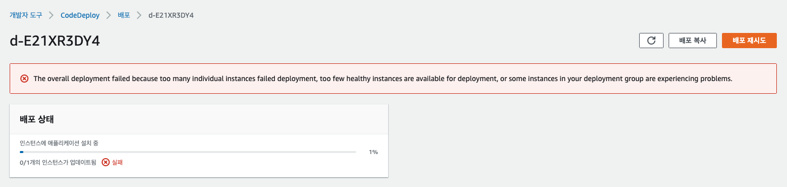
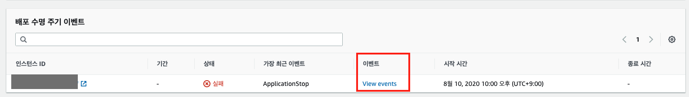
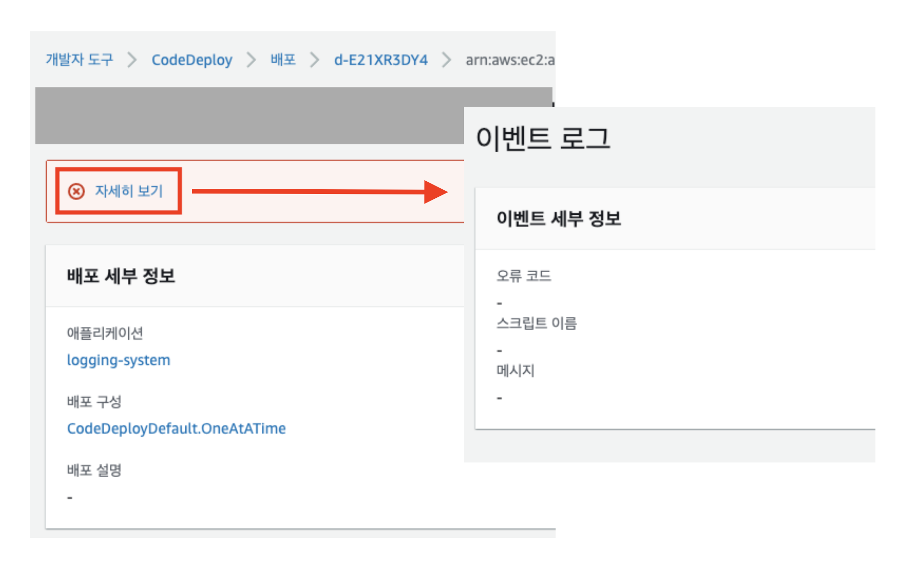

# CodeDeploy View events 에서 에러 로그를 확인할 수 없는 경우
#TIL/devOps

---

## CodeDeploy 배포 실패

### error log 가 없는 경우

CodeDeploy 로 배포 플로우를 구축하다보면 배포가 실패하는 경우가 있습니다.



보통은 에러 로그를 확인하기 위해서 아래와 같이 `View events` 로 접근하여 확인합니다.  





하지만 다음과 같이 아무런 에러 로그가 남지 않는 경우가 있습니다.




### instance 에서 확인하기

이럴 때는 보통 deploy 를 시작하기도 전에 실패한 경우라서, Agent log 를 확인해보면 됩니다.  
해당 EC2 인스턴스의 다음 경로에서 에러 로그를 확인할 수 있습니다.  

`/var/log/aws/codedeploy-agent/codedeploy-agent.log` 

제 경우는 다음과 같은 에러 로그가 있었는데요.  

```vim
InstanceAgent::Plugins::CodeDeployPlugin::CommandPoller: Missing credentials - please check if this instance was started with an IAM instance profile
```

CodeDeploy Agent 가 시작된 후에 IAM Role 을 뒤늦게 연결해서 실패가 났던 것이었습니다.  

해당 IAM Role 을 가지고 Agent 가 시작할 수 있도록 다음과 같이 재시작 해줍니다.  

```bash
sudo service codedeploy-agent restart
```

