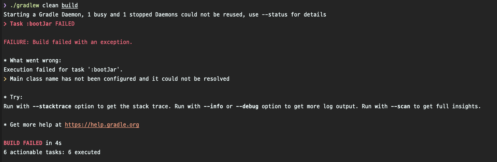

블로그 업로드 : https://www.wbluke.com/28

---

# gradle 빌드 시 main class name has not been configured 문제
#TIL/gradle


---

## 초기 멀티모듈 프로젝트에서
### main class has not configured

초기 스프링 멀티모듈 프로젝트에서 `gradlew build` 시에 아래와 같은 문제가 발생할 때가 있습니다.  



```script
Task :bootJar FAILED

FAILURE: Build failed with an exception.

* What went wrong:
Execution failed for task ':bootJar'.
> Main class name has not been configured and it could not be resolved
```


### main class 지정

에러 메시지를 보면 Main class name이 지정되지 않았다고 하는데요.  
빌드 시에 진입지점을 찾지 못해서 그렇습니다.
이럴 때는 다음과 같이 직접 메인 클래스를 지정해주면 됩니다.  

```script
apply plugin: 'application'
mainClassName = '메인 클래스 풀 패키지명'
```

위의 메인 클래스 이름은 예를 들어  `com.test.example.MainApplication` 처럼 @SpringBootApplication 을 사용하고 있는 메인 클래스의 풀 패키지명을 넣어주시면 됩니다. :-)  

## 참고

- [stackoverflow](https://stackoverflow.com/questions/56861256/gradle-build-failed-main-class-name-has-not-been-configured-and-it-could-not-be/56882464)
- [gradle Application Plugin docs](https://docs.gradle.org/current/userguide/application_plugin.html)
