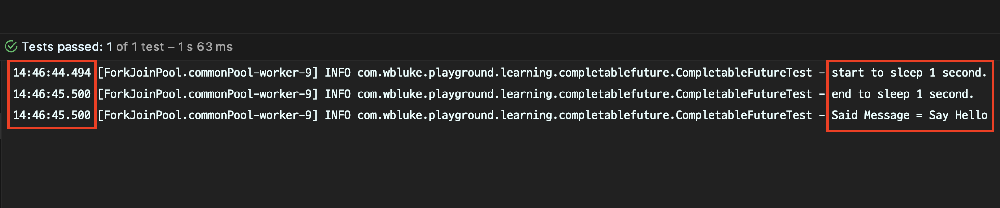
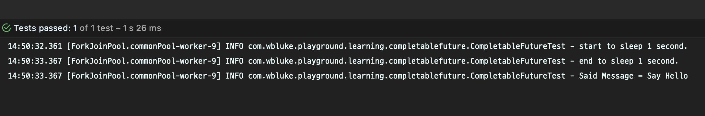
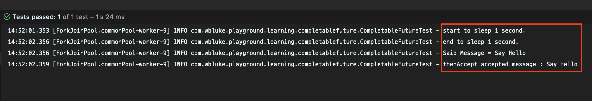
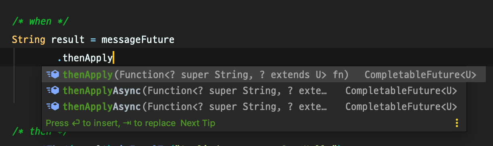
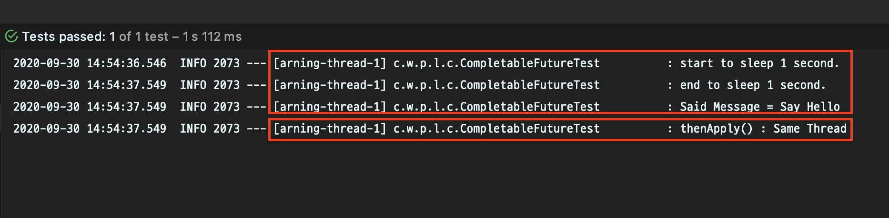
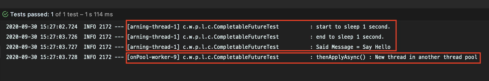
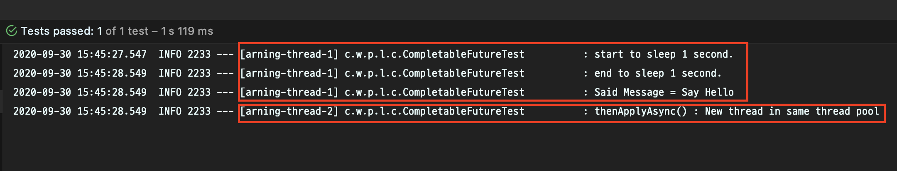
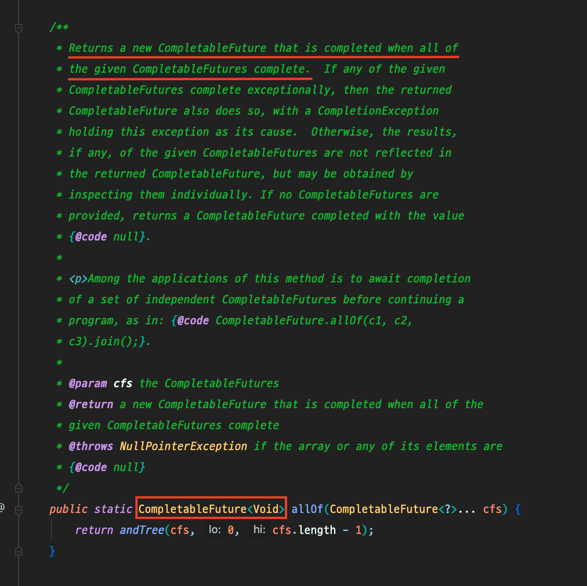

# CompletableFuture 톺아보기
#TIL/java

---

## CompletableFuture 학습 테스트

안녕하세요! 이번 포스팅에서는 학습 테스트를 통해 CompletableFuture를 알아보는 시간을 가져보려고 합니다.
모든 코드는 [GitHub](https://github.com/wbluke/playground)에 있으니 참고하시면 됩니다.  

CompletableFuture는 Java에서 대표적으로 비동기 요청을 처리할 때 사용하는 객체인데요.  
사용하기에 따라 Async-Blocking, Async-Non-Blocking 하게 사용할 수 있습니다.  
제공하는 기능이 꽤 많아서 이 글에서 전부 다루지는 못하지만, 몇 가지 주요 기능을 알고 나면 나머지는 필요에 따라 적용해볼 수 있다고 생각합니다.  

> 동기 / 비동기, Blocking / Non-Blocking 에 대해 감이 잘 안오신다면 [이전 포스팅](https://wbluke.tistory.com/49)을 참조해 주세요 :)

### 학습 테스트를 위한 환경 구성

먼저 학습 테스트를 위해 환경을 구성하겠습니다.  
build.gradle은 다음과 같습니다.  

```js
// build.gradle

dependencies {
    compileOnly 'org.projectlombok:lombok'
    annotationProcessor 'org.projectlombok:lombok'

    runtimeOnly 'com.h2database:h2'

    implementation 'org.springframework.boot:spring-boot-starter-web'

    testImplementation('org.springframework.boot:spring-boot-starter-test') {
        exclude group: 'org.junit.vintage', module: 'junit-vintage-engine'
    }
    testCompileOnly 'org.projectlombok:lombok'
}
```

특별한 것은 없고 맨 마지막 줄에 테스트 패키지에 롬복 의존성을 준 부분만 염두에 두시면 되는데요.  
테스트에서 `@Slf4j`로 log를 사용해 비동기 동작을 확인하기 위함입니다.  

다음으로는 테스트 클래스를 하나 생성해서, 다음과 같이 비동기 상황을 위한 private 메소드를 만들어 보겠습니다.  

```java
@Slf4j
public class CompletableFutureTest {

    private String sayMessage(String message) {
        sleepOneSecond();

        String saidMessage = "Say " + message;
        log.info("Said Message = {}", saidMessage);

        return saidMessage;
    }

    private void sleepOneSecond() {
        try {
            log.info("start to sleep 1 second.");
            Thread.sleep(1000);
            log.info("end to sleep 1 second.");
        } catch (InterruptedException e) {
            throw new IllegalStateException();
        }
    }

}
```

파라미터로 문자열 메시지가 들어오면, 1초 쉰 후에 "Say "를 붙여서 return하는 간단한 형태의 메소드입니다.  
이 때 정확한 동작 타이밍을 알기 위해 sleep 메소드 앞뒤로 log를 찍고, "Say "를 붙인 이후에도 log를 찍도록 하겠습니다.  

이제부터 작성할 모든 테스트는 이 기능을 기반으로 진행됩니다.  


## CompletableFuture

### supplyAsync / runAsync / join

가장 먼저 비동기 동작의 기본이 되는 메소드를 알아보겠습니다.  
supplyAsync()와 runAsync(), 그리고 join()인데요!
테스트 코드를 먼저 보겠습니다.  

```java
@Test
void supplyAsync() {
    /* given */
    String message = "Hello";
    CompletableFuture<String> messageFuture = CompletableFuture.supplyAsync(() -> sayMessage(message));

    /* when */
    String result = messageFuture.join();

    /* then */
    assertThat(result).isEqualTo("Say Hello");
}
```

supplyAsync()는 파라미터로 Supplier 인터페이스를 받아서, 반환값이 존재하는 메소드입니다.  
비동기 상황에서의 작업을 콜백 함수로 넘기고, 작업 수행 여부와 관계 없이 CompletableFuture 객체로 다음 로직을 이어나갈 수 있습니다.  

when 절에서 쓰인 join()은 해당 CompletableFuture가 끝나기를 기다리는 Blocking 메소드라고 할 수 있습니다.
콜백으로 넘긴 작업이 끝나고 난 이후의 결과값을 반환하게 됩니다.  

> get()도 join()과 같은 역할을 하는데요.
> get() 메소드는 Checked Exception을 던지기 때문에 try-catch 구문이나 throws 처리를 해야 합니다.
> 따라서 Unchecked Exception 을 던지는 join()을 쓰는 것이 좋습니다.

사실 join()이 없고 supplyAsync()만으로도 CompletableFuture는 비동기적으로 "Say Hello"를 만들어내는 작업을 수행합니다.
하지만 클라이언트 역할을 하고 있는 테스트 코드에서 해당 작업이 수행되었는지를 확인할 수가 없기 때문에, Blocking을 걸어 then절에서 검증 작업을 수행하도록 하겠습니다.  



실행하면서 로그를 보시면 sleep 메소드가 1초 동안 수행되고 원하는 결과가 잘 나왔음을 볼 수 있습니다.

이어서 runAsync()를 볼까요?

```java
@Test
void runAsync() {
    /* given */
    String message = "Hello";
    CompletableFuture<Void> messageFuture = CompletableFuture.runAsync(() -> sayMessage(message));

    /* when */ /* then */
    messageFuture.join();
}
```

runAsync()는 파라미터로 Runnable 인터페이스를 받아서, 반환값이 존재하지 않습니다.  
따라서 반환값이 굳이 필요 없는 작업을 비동기로 처리할 때에 유용한 방법입니다.  

supplyAsync()에서와 마찬가지로 join()을 사용하여 Blocking을 걸고, 로그로 동작을 확인해보시면 잘 동작하는 것을 확인할 수 있습니다.



> 모든 테스트 코드에서는 자동화된 테스트를 위해 assert 검증문이 있어야 하지만, 학습 테스트이기도 하고 반환값이 없는 메소드이기에 log로만 확인하였습니다.


### completedFuture

다음은 completedFuture인데요.

```java
@Test
void completedFuture() {
    /* given */
    String message = "Hello";
    CompletableFuture<String> messageFuture = CompletableFuture.completedFuture(message);

    /* when */
    String result = messageFuture.join();

    /* then */
    assertThat(result).isEqualTo("Hello");
}
```

이미 완료된 작업이나 정적인 값을 CompletableFuture로 감쌀 필요가 있을 때 사용합니다. 간단하죠?


### thenApply / thenAccept

다음으로는 메소드 체이닝으로 CompletableFuture에 후속 작업을 지정할 수 있는 thenApply()와 thenAccept()를 알아보겠습니다.  

```java
@Test
void thenApply() {
    /* given */
    String message = "Hello";
    CompletableFuture<String> messageFuture = CompletableFuture.supplyAsync(() -> sayMessage(message));

    /* when */
    String result = messageFuture
            .thenApply(saidMessage -> "Applied message : " + saidMessage)
            .join();

    /* then */
    assertThat(result).isEqualTo("Applied message : Say Hello");
}

```

```java
@Test
void thenAccept() {
    /* given */
    String message = "Hello";
    CompletableFuture<String> messageFuture = CompletableFuture.supplyAsync(() -> sayMessage(message));

    /* when */ /* then */
    messageFuture
            .thenAccept(saidMessage -> {
                String acceptedMessage = "accepted message : " + saidMessage;
                log.info("thenAccept {}", acceptedMessage);
            })
            .join();
}
```

사용은 간단합니다.  
앞 CompletableFuture에서 반환된 값을 가지고 또 다른 작업을 할 수 있습니다.  
thenApply()는 반환형이 존재하는 메소드, thenAccept()는 반환형이 없는(Void) 콜백 작업을 받습니다.

테스트를 위해 메소드 체이닝으로 join()까지 걸어서 실행해보시면, 잘 적용되는 것을 확인하실 수 있습니다.  
thenAccept()는 반환하는 값이 없기 때문에 log를 찍어서 확인해보도록 하겠습니다.



잘 동작하네요!


### Thread Pool 지정에 따른 차이

여기서 잠시 thenApply()를 사용할 때의 메소드 리스트를 확인해보시면, 다음과 같이 세 종류의 메소드가 있는 것을 보실 수 있습니다.  



방금 살펴보았던 일반적인 thenApply()와, 무언가 비동기적으로 동작할 것 같은 ~~이미 비동기인데요~~ thenApplyAsync() 메소드가 두 개 더 있습니다.  
마지막 thenApplyAsync()는 콜백 함수 외에 두 번째 인자로 스레드 풀(Executor)을 받는데요.  

이 `~~~Async()`  메소드의 구성은 아래에 이어서 소개될 대부분의 CompletableFuture의 메소드에 적용되는 부분이기 때문에 어떻게 동작하는 기능인지를 알아둘 필요가 있습니다.  
thenApply()를 예로 들어서 한번 하나씩 알아보도록 하겠습니다.  

지금까지의 테스트에서는 log에서 보셨다시피 자바에서 제공하는 기본 ForkJoinPool을 사용하고 있었는데요.
명확한 실험을 위해 먼저 Custom한 스레드 풀을 하나 만들고, 스프링을 띄워서 테스트해 보도록 하겠습니다.  

```java
@EnableAsync
@Configuration
public class AsyncConfig {

    public static final String LEARNING_DEFAULT_EXECUTOR_NAME = "threadPoolTaskExecutor";
    private static final int POOL_SIZE = 3;

    @Bean(name = LEARNING_DEFAULT_EXECUTOR_NAME)
    public Executor threadPoolTaskExecutor() {
        ThreadPoolTaskExecutor executor = new ThreadPoolTaskExecutor();

        executor.setCorePoolSize(POOL_SIZE);
        executor.setMaxPoolSize(POOL_SIZE);
        executor.setThreadNamePrefix("learning-thread-");
        return executor;
    }

}
```

Configuration 파일을 하나 만들고, ThreadPoolTaskExecutor를 생성해 Bean으로 등록하겠습니다.  
풀의 사이즈는 3으로 두고, 기본 스레드 풀과 구분할 수 있도록 prefix도 지정하겠습니다.  

```java
@Slf4j
@SpringBootTest
public class CompletableFutureTest {

    @Autowired
    private Executor threadPoolTaskExecutor;

    // ...

}
```

그리고 테스트 클래스에 `@SpringBootTest` 를 지정한 뒤, Bean으로 등록한 Executor를 불러오도록 하겠습니다.  
이제 하나씩 살펴 볼까요?  

```java
@DisplayName("thenApply() : 처음 진행한 스레드가 쭉 이어서 진행한다.")
@Test
void thenApplyWithSameThread() {
    /* given */
    String message = "Hello";
    CompletableFuture<String> messageFuture = CompletableFuture.supplyAsync(
            () -> sayMessage(message), threadPoolTaskExecutor
    );

    /* when */
    String result = messageFuture
            .thenApply(saidMessage -> {
                log.info("thenApply() : Same Thread");
                return "Applied message : " + saidMessage;
            })
            .join();

    /* then */
    assertThat(result).isEqualTo("Applied message : Say Hello");
}
```

먼저 일반적인 thenApply()의 경우를 좀 더 자세히 보기 위해 우리가 만든 스레드 풀을 지정해서 살펴보겠습니다.  
given절에서 CompletableFuture를 만들 때, 두 번째 인자로 스레드 풀을 지정하면 해당 스레드 풀의 스레드가 비동기 작업을 진행하게 됩니다.  
그리고 when절의 thenApply()에서 후속 작업을 진행할 때도 같은 스레드가 후속 작업을 이어서 진행하게 됩니다.  
로그로 한번 볼까요?



첫 작업을 진행한 1번 스레드가 동일하게 후속 작업까지 진행한 것을 볼 수 있습니다.  

이어서 스레드 풀을 지정하지 않은 thenApplyAsync()를 보겠습니다.  

```java
@DisplayName("thenApplyAsync() : 스레드 풀을 지정하지 않으면 기본 스레드 풀의 새로운 스레드가 async하게 진행한다.")
@Test
void thenApplyAsync() {
    /* given */
    String message = "Hello";
    CompletableFuture<String> messageFuture = CompletableFuture.supplyAsync(
            () -> sayMessage(message), threadPoolTaskExecutor
    );

    /* when */
    String result = messageFuture
            .thenApplyAsync(saidMessage -> {
                log.info("thenApplyAsync() : New thread in another thread pool");
                return "Applied message : " + saidMessage;
            })
            .join();

    /* then */
    assertThat(result).isEqualTo("Applied message : Say Hello");
}
```

given절에서는 custom한 스레드 풀을 지정했고, when절의 thenApplyAsync()에서는 아무런 스레드 풀을 지정하지 않았습니다.  
실행 후 로그를 한번 보시면!  



given절의 비동기 작업은 우리가 지정한 스레드 풀의 1번 스레드가 수행했지만, 이후 thenApplyAsync()의 후속 작업은 기본 스레드 풀인 ForkJoinPool의 스레드가 수행한 것을 알 수 있습니다.  (이름은 조금 잘렸지만...)

그렇다면 given절과 when절에 같은 스레드 풀을 지정하면 어떨까요? 

```java
@DisplayName("handleAsync() : 지정한 스레드 풀의 새로운 스레드가 async하게 진행한다.")
@Test
void thenApplyAsyncWithAnotherThreadPool() {
    /* given */
    String message = "Hello";
    CompletableFuture<String> messageFuture = CompletableFuture.supplyAsync(
            () -> sayMessage(message), threadPoolTaskExecutor
    );

    /* when */
    String result = messageFuture
            .thenApplyAsync(saidMessage -> {
                log.info("thenApplyAsync() : New thread in same thread pool");
                return "Applied message : " + saidMessage;
            }, threadPoolTaskExecutor)
            .join();

    /* then */
    assertThat(result).isEqualTo("Applied message : Say Hello");
}
```

thenApplyAsync()의 두 번째 인자로 given절에서와 같은 custom 스레드 풀을 넣어주고 실행해 보겠습니다.



첫 비동기 작업은 1번 스레드가 수행하고, 후속 비동기 작업은 2번 스레드가 수행한 것을 알 수 있습니다.  

이를 통해 Async suffix가 붙은 메소드는 처음 작업을 수행한 스레드가 아닌 다른 스레드가 후속 작업을 진행한다는 것을 알 수 있습니다.  
그리고 후속 작업이 첫 작업과 같은 스레드 풀에서 진행된다면, 해당 스레드 풀의 다른 스레드가 이 작업을 이어 받아서 수행한다는 것도 알 수 있습니다.  
아래에서 소개할 handle(), thenCompose(), thenCombine()과, 이 포스팅에서 소개하지 않은 다른 메소드들도 `Async` suffix가 붙은 메소드는 이와 같이 동작한다고 이해하시면 되겠습니다.  

이어서 다른 기능들도 한번 살펴보겠습니다!


### exceptionally / handle

이번에는 비동기 상황에서 예외가 발생했을 경우 어떻게 처리할 수 있는지를 알아보겠습니다.  
먼저 다음과 같이 1초 후에 예외를 발생시키는 private 메소드를 작성하겠습니다.

```java
private String sayMessageThrowingException(String message) {
    sleepOneSecond();

    throw new IllegalStateException("exception message");
}
```

먼저 exceptionally()를 알아보겠습니다.  
CompletableFuture 작업에서 예외가 발생했을 경우, 해당 예외를 인자로 받아 처리할 수 있습니다.

```java
@Test
void exceptionally() {
    /* given */
    String message = "Hello";
    CompletableFuture<String> messageFuture = CompletableFuture.supplyAsync(() -> sayMessageThrowingException(message));

    /* when */
    String result = messageFuture
            .exceptionally(Throwable::getMessage)
            .join();

    /* then */
    assertThat(result).isEqualTo("java.lang.IllegalStateException: exception message");
}
```

그리고 handle()이라는 메소드로 정상 결과와 예외 결과를 종합적으로 처리할 수도 있는데요.

```java
@DisplayName("CompletableFuture.handle()")
@Test
void handle() {
    /* given */
    String message = "Hello";
    CompletableFuture<String> messageFuture = CompletableFuture.supplyAsync(() -> sayMessage(message));

    /* when */
    String result = messageFuture
            .handle((saidMessage, throwable) -> "Applied message : " + saidMessage)
            .join();

    /* then */
    assertThat(result).isEqualTo("Applied message : Say Hello");
}
```

handle()은 보시다시피 정상 결과를 첫 번째 인자로, 예외를 두 번째 인자로 받는 BiFunction 인터페이스를 콜백 함수로 받아서 작업을 진행합니다.
만약 앞 비동기 작업이 정상적으로 진행되었다면 두 번째 인자의 throwable 예외는 null 값이고, 예외가 발생했다면 첫 번째 인자의 saidMessage가 null이 들어옵니다.
상황에 따라 if문 등으로 분기 로직을 만들 수도 있겠네요.


### allOf

```java
@Test
void allOf() {
    /* given */
    List<String> messages = Arrays.asList("Hello", "Hi", "Bye", "Yes", "No");
    List<CompletableFuture<String>> messageFutures = messages.stream()
            .map(message -> CompletableFuture.supplyAsync(() -> this.sayMessage(message)))
            .collect(Collectors.toList());

    /* when */
    List<String> saidMessages = CompletableFuture.allOf(messageFutures.toArray(new CompletableFuture[0]))
            .thenApply(Void -> messageFutures.stream()
                    .map(CompletableFuture::join)
                    .collect(Collectors.toList()))
            .join();

    /* then */
    List<String> expectedMessages = Arrays.asList("Say Hello", "Say Hi", "Say Bye", "Say Yes", "Say No");
    assertThat(expectedMessages.equals(saidMessages)).isTrue();
}
```

allOf()는 여러 CompletableFuture를 한번에 Blocking할 때 아주 유용한 메소드입니다.  

given절에서 먼저 다섯 개의 문자열을 차례로 비동기 작업을 걸어 CompletableFuture로 만들었습니다.  
이 때 모든 작업이 끝나기를 기다린 후 결과 리스트를 반환받고 싶다면, when절에서와 같이 작성해야 합니다.  




allOf()의 메소드 시그니처를 보면 아시겠지만, 해당 메소드는 모든 CompletableFuture에 Blocking만 걸 뿐, 결과를 직접 반환하지는 않습니다.
따라서 모든 작업이 완료되었음을 allOf()를 통해 보장받고 나면, thenApply()를 통해 직접 given절의 CompletableFuture 리스트에서 join()으로 값을 꺼내주는 작업을 거쳐야 합니다.  
thenApply()는 `List<Completable<String>>`을 감싼 CompletableFuture를 반환하기 때문에, 마지막에 join()으로 최종적인 결과 리스트를 꺼내어 사용할 수 있습니다.

이와 마찬가지로 anyOf()라는 메소드도 있는데요.
여러 CompletableFuture 중 하나라도 완료된 작업이 있다면 후속 작업을 진행할 수 있게 해주는 기능이니 참고하시면 될 것 같습니다.


### thenCompose / thenCombine

마지막으로 CompletableFuture의 조합 연산인 thenCompose()와 thenCombine()을 살펴보겠습니다.

```java
@Test
void thenCompose() {
    /* given */
    String message = "Hello";
    CompletableFuture<String> messageFuture = CompletableFuture.supplyAsync(() -> sayMessage(message));

    /* when */
    String result = messageFuture
            .thenCompose(saidMessage -> CompletableFuture.supplyAsync(() -> {
                sleepOneSecond();
                return saidMessage + "!";
            }))
            .join();

    /* then */
    assertThat(result).isEqualTo("Say Hello!");
}
```

thenCompose()는 thenApply()와 비슷하지만, 또 다른 CompletableFuture를 파이프라인 형식으로 연결해서 실행할 수 있는 기능입니다.  
앞 단계에서의 결과(saidMessage)를 파라미터로 받으면서, 또 다른 CompletableFuture를 반환하는 Function 인터페이스를 인자로 받습니다.

```java
@Test
void thenCombine() {
    /* given */
    String message = "Hello";
    CompletableFuture<String> messageFuture = CompletableFuture.supplyAsync(() -> sayMessage(message));

    /* when */
    String result = messageFuture
            .thenCombine(CompletableFuture.supplyAsync(() -> {
                sleepOneSecond();
                return "!";
            }), (message1, message2) -> message1 + message2)
            .join();

    /* then */
    assertThat(result).isEqualTo("Say Hello!");
}
```

thenCombine()은 thenCompose() 처럼 앞 단계의 결과를 인자로 받지 않고, 전혀 다른 CompletableFuture를 첫 번째 인자로 받고, 두 번째 인자로 두 CompletableFuture의 결과를 연산하는 BiFunction 인터페이스를 받습니다.
비슷비슷해 보이는 CompletableFuture의 조합 연산이지만, 내가 필요한 상황에 따라 메소드 시그니처를 잘 파악하면서 적용해보면 좋을 것 같습니다.

이렇게 CompletableFuture에 대해 학습 테스트를 진행하면서 알아보았는데요.
새롭거나 명확하게 알지 못하는 개념에 대해 알아가고자 할 때는 학습 테스트만한 방법이 없는 것 같습니다.
다음에도 또 다른 학습 테스트 주제가 생기면 실험하고 공유해보도록 하겠습니다!

이번 글은 여기까지입니다. 읽어주셔서 감사합니다! :-)


