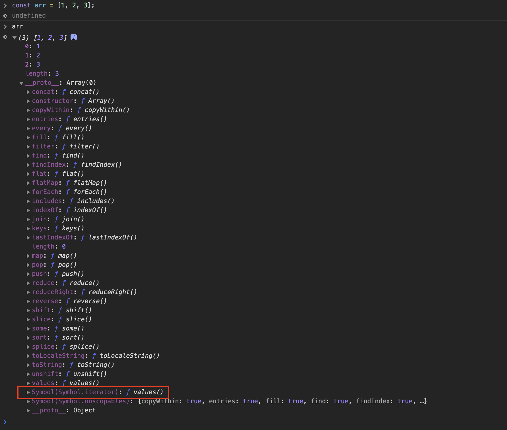
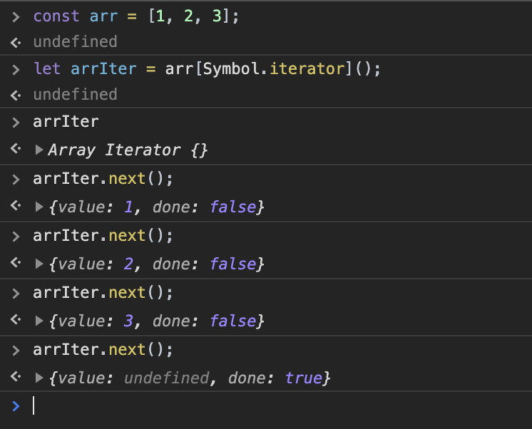
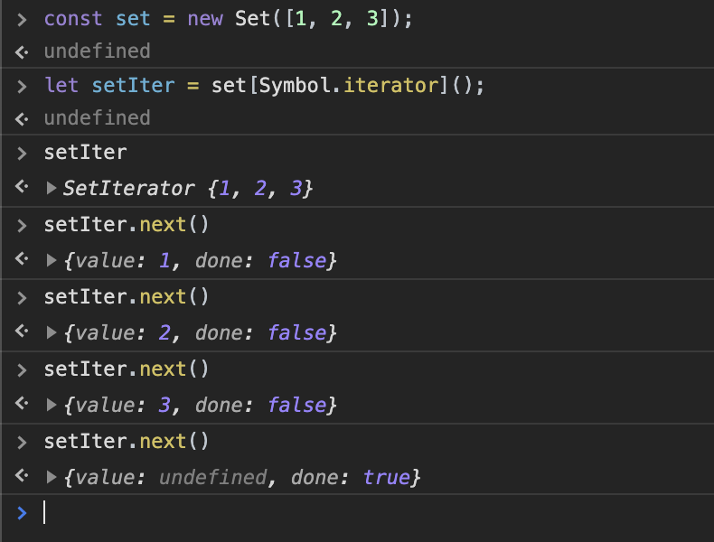
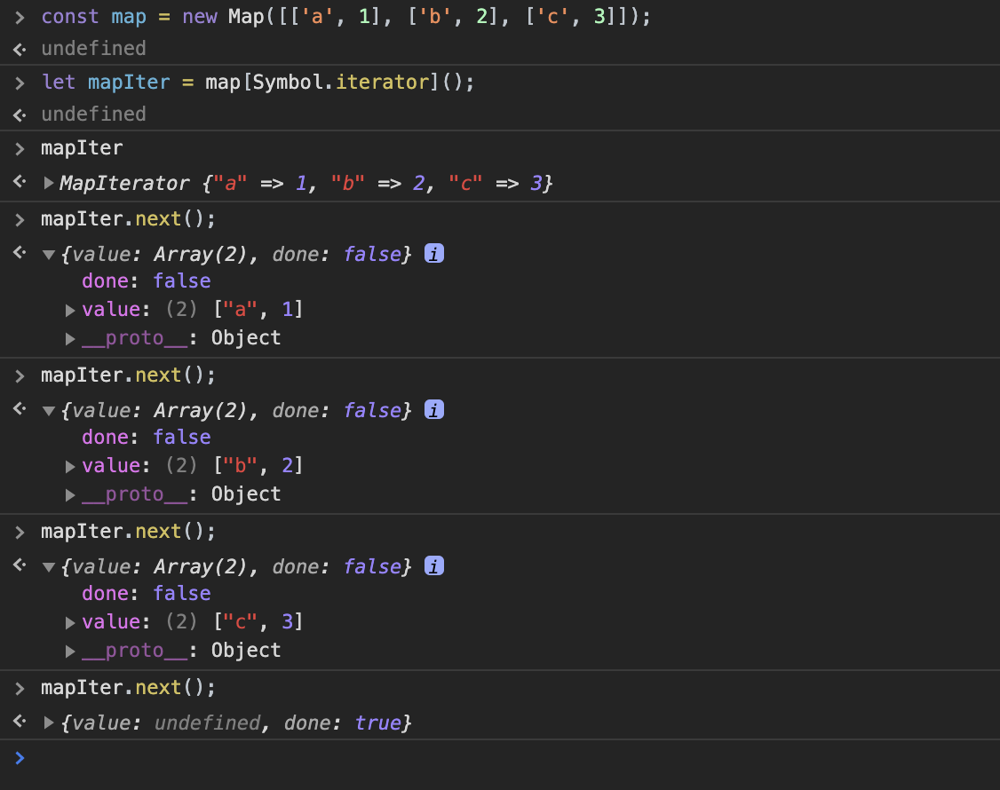

- 블로그 업로드 : https://www.wbluke.com/34
---

# 이터러블 프로토콜
## 개요
이번 포스팅에서는 `이터러블 프로토콜`에 대해서 정리해 보겠습니다.  

이터러블 프로토콜은 자바스크립트 ES6에서 순회와 관련한 핵심적인 개념으로, 이터러블 프로토콜을 중점으로 사고하면서 코드를 작성하면 많은 이점이 있습니다.  

## 이터러블/이터레이터
### Array 살펴보기



크롬 개발자 도구에서 콘솔창을 열고 배열 하나를 만들어 보았습니다.  
해당 배열의 속성을 열어보면, 많은 항목들 중에 `Symbol.iterator`가 있는 것을 볼 수 있는데요.  
`Symbol.iterator`라는 Key가 가진 값이 함수라고 명시되어 있습니다.  
이 함수가 바로 이터러블 프로토콜을 정의하는 친구입니다.  

### 이터러블/이터레이터 프로토콜

이터러블의 정의는 다음과 같습니다.  

```md
이터레이터를 리턴하는 [Symbol.iterator]()를 가진 값
```

앞서 배열은 `Symbol.iterator`라는 일종의 Key를 가지고 있고, 이 Key가 가리키고 있는 것이 함수라는 것을 보았습니다.  
그리고 이 함수를 실행시켜서 나오는 값이 바로 `이터레이터`입니다.  
그래서 배열은 **이터러블하다**라고 말할 수 있습니다.  

이터레이터를 꺼내서 사용해보면 다음과 같습니다.  



이터레이터는 위에서 볼 수 있듯이 next()라는 함수를 호출할 수 있고, 해당 함수를 실행하면 `value`와 `done` 필드를 가지고 있는 객체를 리턴하는 것을 알 수 있습니다.  

이렇게 `value`와 `done`을 가진 객체를 리턴하는 next() 함수를 가진 값을 **이터레이터**라고 합니다.  

그리고 이러한 이터러블한 값을 for...of나 전개 연산자 등과 함께 순회할 수 있도록 정의한 규약이 바로 **이터러블/이터레이터 프로토콜**입니다.  

비슷비슷한 표현들이 많아서 한번 정리해 보자면 이렇습니다.  

- 이러터블 : 이터레이터를 리턴하는 `[Symbol.iterator]()`를 가진 값
- 이터레이터 : { value, done } 객체를 리턴하는 next()를 가진 값
- 이터러블/이터레이터 프로토콜 : 이터러블을 for...of, 전개 연산자 등과 함께 동작하도록 한 규약

### 이터레이터

앞서 이터레이터가 동작하는 방식을 보았는데요.  
next() 함수를 호출할 때마다 value의 값은 배열의 값을 순서대로 리턴합니다.  
그리고 모든 원소를 순회하기를 마치면 false였던 값이 true로 바뀌고 value는 정의되지 않는 것을 볼 수 있습니다.  

이터레이터는 next()를 호출한 만큼 원소의 값을 순차적으로 가리키고, 다시 앞으로 돌아가거나 건너뛸 수는 없습니다.  
순회가 끝난 이터레이터를 재사용하는 것도 불가능합니다.  

배열과 마찬가지로 이터러블한 Set과 Map의 경우도 한번 살펴 보겠습니다.  





Set은 Array와 큰 차이가 없고, Map은 value가 각각의 키와 값을 가지고 있는 배열임을 볼 수 있습니다.  

### 이터레이터도 이터러블하다

위에서처럼 이터러블한 값에서 가져온 이터레이터는 그 자체로도 이터러블합니다.  
즉, 이터레이터도 다음과 같이 `Symbol.iterator`를 Key로 하는 이터레이터 리턴 함수를 가집니다.  
이 때 반환되는 이터레이터는 자기 자신입니다.  

```js
const arr = [1, 2, 3];
let arrIter = arr[Symbol.iterator]();

let iter = arrIter[Symbol.iterator](); // 이터레이터도 자기 자신인 이터레이터를 반환한다.
iter.next(); // { value : 1, done : false }
iter.next(); // { value : 2, done : false }
iter.next(); // { value : 3, done : false }
iter.next(); // { value : undefined, done : true }
```

### 제너레이터

제너레이터는 **이터레이터이면서 이터러블을 생성하는 함수**를 말합니다.  
제너레이터를 사용하면, 어떤 값이든 순회할 수 있는 이터러블로 만들 수 있습니다.  

```js
function *gen() {
  yield 1;
  yield 2;
  yield 3;
}

let iter = gen();
iter.next(); // { value : 1, done : false }
iter.next(); // { value : 2, done : false }
iter.next(); // { value : 3, done : false }
iter.next(); // { value : undefined, done : true }
```

> [yield](https://developer.mozilla.org/ko/docs/Web/JavaScript/Reference/Operators/yield)는 value, done 두 속성을 가진 IteratorResult 객체를 반환하는 키워드입니다.
> yield 표현식에서 중지되면, 제너레이터의 next() 메소드가 호출될 때까지 제너레이터의 코드 실행이 중지됩니다.  

## 이터러블/이터레이터의 이점

이터러블하다는 것은 **원소들을 차례로 순회할 수 있다**는 것입니다.  

이터러블한 기본 자료구조 뿐만 아니라 이터러블 프로토콜을 지키는 사용자 정의 객체들은 for...of문으로 순회하거나 전개 연산자를 사용하여 순회할 수 있다는 이점이 생깁니다.  

```js
const numbers = [1, 2, 3, 4, 5];
for (const number of numbers) { // 이터레이터를 사용하는 for...of 순회
  console.log(number);
}

const [a, b, ...rest] = numbers; // 이터레이터를 사용하는 전개 연산자
log(a); // 1
log(b); // 2
log(rest); // [3, 4, 5]
```

사용자의 의도에 따라 새롭게 정의한 자료구조나 객체를 이터러블 프로토콜을 따르게 하여 순회가능함을 명시할 수도 있고, 필요에 따라 전개 연산자 등을 사용하여 깔끔하게 코드를 작성할 수도 있습니다.  

이터러블 프로토콜이라는 하나의 규약을 통해 `순회할 수 있다`는 기준이 하나로 통합된 덕분입니다.  

