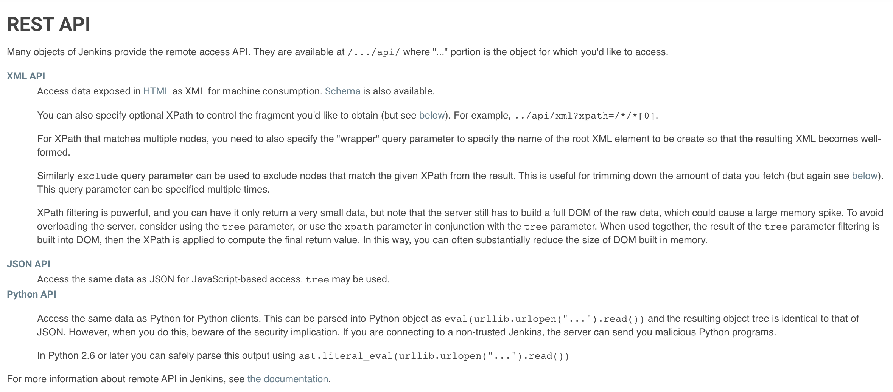
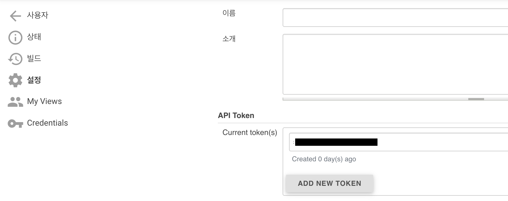
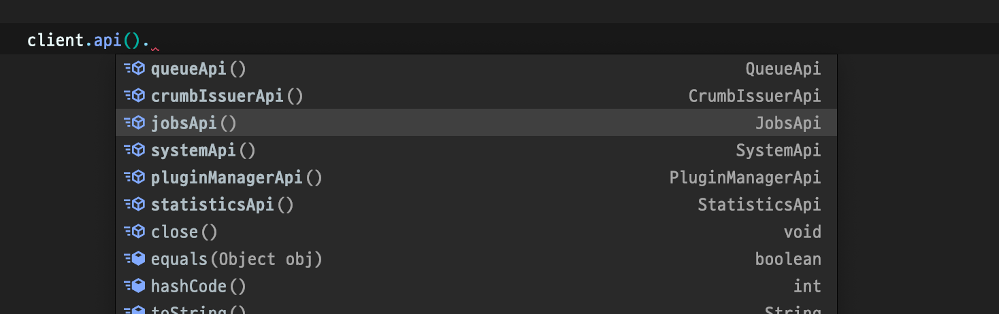
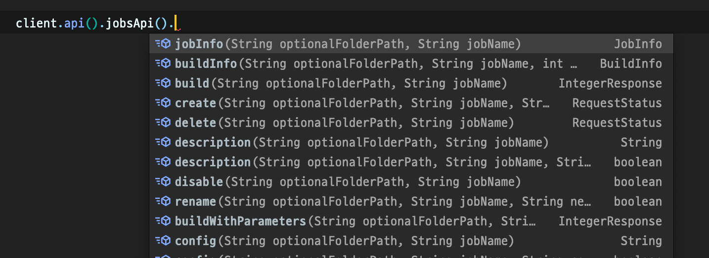

블로그 업로드 : https://www.wbluke.com/29

---

# Jenkins-rest 로 Jenkins API 사용하기
#TIL/jenkins

---

## jenkins-rest

CI 관리 도구인 젠킨스를 사용하다 보면 직접 들어가서 사용할 수도 있지만, 젠킨스 API를 통해 코드로 작업할 필요가 생길 수도 있는데요.  

Jenkins API를 좀 더 쉽게 접근할 수 있는 [jenkins-rest](https://github.com/cdancy/jenkins-rest) 라이브러리를 소개하겠습니다.  


## Jenkins API

### API 문서

젠킨스 API에 관해서는 젠킨스 주소 뒤에 `/api`를 붙이면 해당 문서를 볼 수 있는데요, XML, JSON, Python 이 세 가지 형태로 제공한다고 합니다.  



보시면 아시겠지만 그닥 사용자 친화적이지는 않습니다. ㅠㅠ  

그래서 한 번 jenkins-rest를 통해 자바 코드로 API를 사용해보도록 하겠습니다.  


### 토큰 발급하기

라이브러리를 사용해보기 전에, 먼저 젠킨스에 접근할 수 있는 인증 토큰을 발급받아야 하는데요, 우측 상단에 본인 계정 > 설정 에 가시면 `API Token` 이라는 탭이 있습니다.  



해당 탭에서 `ADD NEW TOKEN`을 눌러 인증키의 이름을 정하고 토큰을 발급받을 수 있습니다.  

발급 받은 토큰은 최초 발급 시에 잘 저장해두세요!  


## 시작하기

### 의존성 주입

[gradle - mvn repository](https://mvnrepository.com/artifact/com.cdancy/jenkins-rest?repo=jcenter) 를 참고하여 프로젝트에 의존성을 주입합니다.  

```js
// build.gradle

// jenkins rest api
compile "com.cdancy:jenkins-rest:0.0.19:all"
```

### JenkinsClient

사용법은 간단합니다. JenkinsClient 라는 친구를 빌더로 생성할건데요.  

접근하고 싶은 젠킨스의 URL을 endPoint에, 그리고 토큰을 발급받은 사용자의 이름과 토큰을 `:` 으로 연결하여 creadentials 에 넣어주면 됩니다.  

```java
JenkinsClient client = JenkinsClient.builder()
        .endPoint(JENKINS_URL)
        .credentials("USER_NAME:TOKEN")
        .build();
```


### JobsApi()



이제 생성한 client를 가지고 여러 가지 작업을 해보실 수 있는데요, `client.api()`  하위를 보시면 젠킨스 자체의 정보를 가져올 수 있는   `systemApi()` 라던지, 플러그인을 설치하거나 관리할 수 있는 `pluginManagerApi()`  같은 API들이 있는 것을 알 수 있습니다.  

저는 주로 젠킨스 Job에 대해 조회할 것이므로, `jobsApi()`를 선택해 보겠습니다.



보시면 아시겠지만, 젠킨스 Job에 대해서 생성, 빌드 실행, 삭제 등 원하는 일들을 편하게 진행하실 수 있습니다!  

첫 번째 파라미터인 optionalFolderPath는 만약 젠킨스 Job이 폴더로 관리되고 있다면 해당 폴더 이름을 넣으시면 되고, 딱히 폴더 안에 Job이 있는 것이 아니라면 null을 넣으시면 됩니다.  (따라 들어가 보시면 @Nullable 처리되어 있는 것을 보실 수 있습니다.)  

그리고 두 번째 파라미터인 jobName에 내가 접근하고 싶은 Job의 이름을 넣으면 됩니다.  

요렇게 만들어진 JobsApi는 URL과 사용자 토큰 정보가 모두 맞다면 `JENKINS_URL/job/OPTIONAL_FOLDER_PATH/job/JOB_NAME/` 으로 요청을 날려 원하는 정보를 가져옵니다.  

요청할 수 있는 정보는 살펴 보시면 직관적으로 쉽게 알 수 있는데요, 몇 가지 소개해 드리자면 다음과 같습니다.  

```java
JobInfo jobInfo = jobsApi.jobInfo(null, JOB_NAME);
jobInfo.buildable(); // job의 빌드 활성화 여부
jobInfo.builds(); // 해당 job의 모든 빌드 가져오기
jobInfo.lastSuccessfulBuild(); // 가장 최근에 성공한 빌드
jobInfo.lastFailedBuild(); // 가장 최근에 실패한 빌드

BuildInfo lastBuild = jobInfo.lastBuild(); // 가장 최근 빌드 가져오기
lastBuild.building(); // 현재 빌드 실행 중인지 (boolean)
lastBuild.result(); // 성공 - SUCCESS / 실패 - FAILURE / 아직 결과가 없으면 null
```

소개한 메소드는 아주 일부이니 필요한 상황에 맞게 찾아서 사용하시면 될 것 같습니다. ㅎㅎ  

이번 글은 여기서 마치겠습니다. 감사합니다! :-)  
