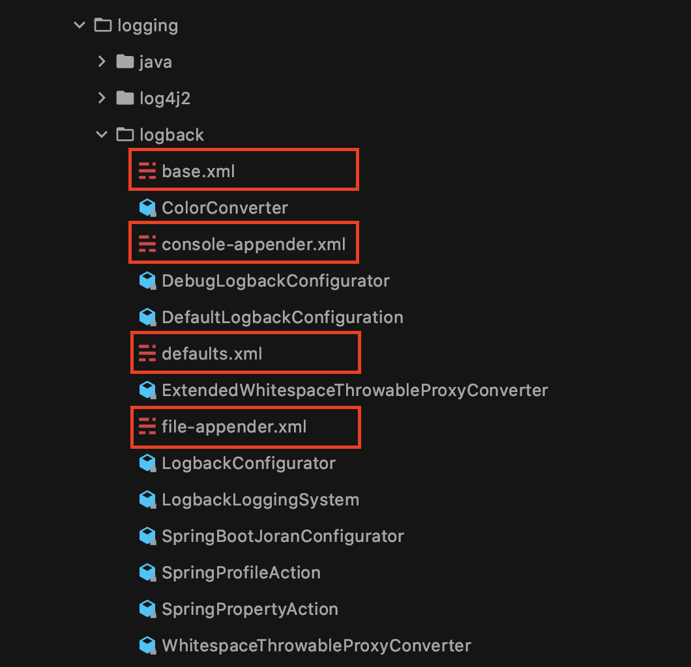
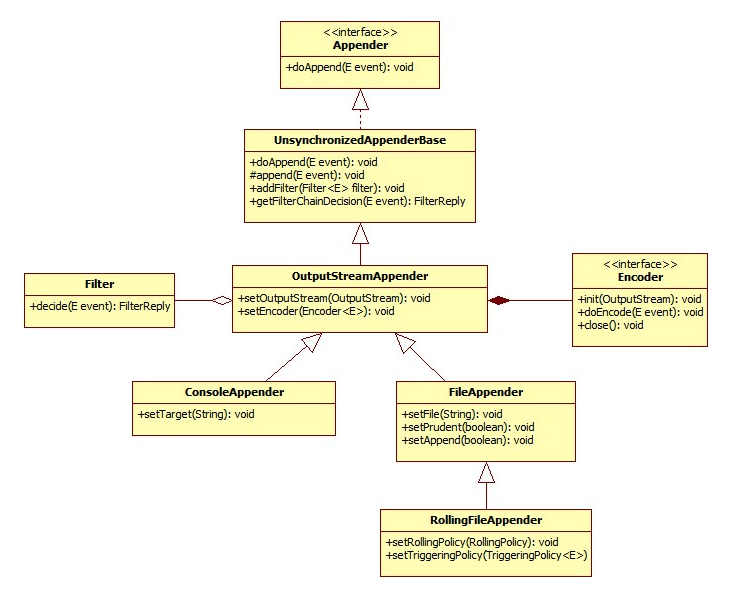
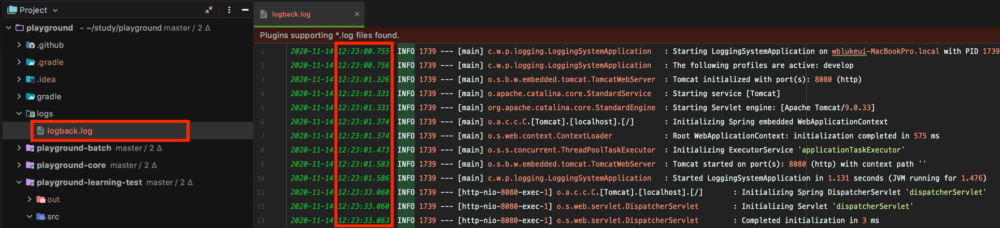
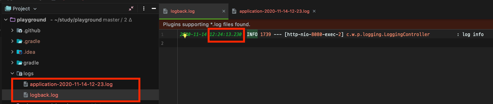
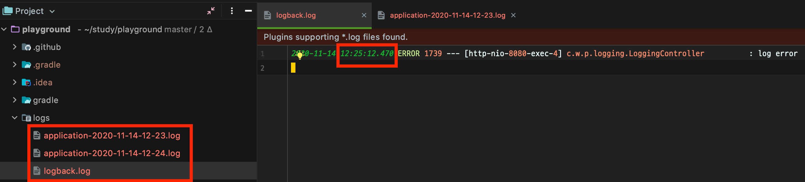
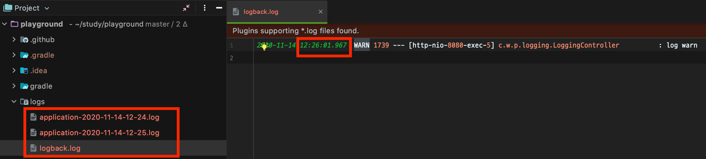

- 블로그 업로드 : https://wbluke.tistory.com/51

---

# Logback
#TIL/spring

---

## Logback

안녕하세요~ 이번 포스팅에서는 Logback의 구조와 사용 방법에 대해서 정리해보려고 합니다.  
모든 내용을 다 다룰 수는 없지만, 기본적인 구조를 인지하고 있으면 나머지는 필요할 때마다 찾아보면서 적용할 수 있습니다.  
특히 Logback은 공식 문서가 꼼꼼하게 되어있는 편이어서, 없는 것 빼고 다 있다는 느낌이 들기도 합니다. ~~영어지만요~~  


### Logback이란?

먼저 Logback이 어떤 것인지 잠깐 짚고 넘어가도록 하겠습니다.  
간단히 말해서 java.util.logging, log4j, log4j2를 잇는 **자바 로깅 프레임워크**인데요.  
위 유틸들에 비해서 좋은 성능을 가지고 있으며, 특히 Spring boot에서는 기본 로깅 모듈로 채택하고 있기 때문에 많은 분들이 알게 모르게 Spring boot를 사용하시면서 접하셨을 것입니다.  

> spring-boot-starter-web 패키지 안에 Logback이 포함돼 있습니다.  


### Logback으로 로그 관리하기

Logback으로 정확히 뭘 할 수 있는가? 에 대해서 생각해보겠습니다.  
로그라는 것은 사용하기에 따라 애플리케이션에서 일어나는 일들을 기록으로 남겨서, 실시간으로, 혹은 과거에 일어났던 사건을 역으로 트래킹할 수 있는 좋은 자료라고 할 수 있는데요.  
그렇기에 로그의 내용에 따라 **적정한 로그 레벨과 로깅 위치**를 결정하는 것은 아주 중요한 일일 것입니다.  

더불어 애플리케이션에 로그를 잘 남기는 것도 매우 중요하지만, 잘 남긴 로그를 어디서 어떤 방식으로 보관할지, 어떻게 이 로그들을 확인하고 분석할 수 있을지 고민하는 일도 상당히 중요한 일입니다.  
이를 위해 Logback 설정 파일로 다음과 같은 것들을 지정할 수 있습니다.  

- 로그를 콘솔에 출력만 할지, 파일로 남길지, 네트워크를 통해 외부로 바로 전달할지 등을 결정하기
- Spring Profile 별로 로그 설정을 다르게 가져가기
- 일정 로그 레벨 이상의 로그들만 남기기
- 로그의 형식 지정하기
- 일정 시간이 지날 때마다, 시간 별로 로그 파일을 정리하거나 로그 파일을 압축해서 보관하기

또한 이렇게 로그를 파일로 남기면, [ELK Stack](https://www.elastic.co/kr/what-is/elk-stack) 같은 데이터 모니터링 도구를 활용해서 필요한 로그를 검색하거나 분석할 수도 있습니다.  


## Logback 설정하기

### logback-spring.xml

이제 Spring boot에서 Logback 설정하는 법을 알아보도록 하겠습니다.  
먼저 build.gradle에는 다음과 같이 spring-boot-starter-web 을 지정하도록 하겠습니다.  
그리고 lombok 사용을 위한 설정도 같이 넣어주도록 하겠습니다.  

```javascript
// build.gradle

dependencies {
    implementation 'org.projectlombok:lombok'
    annotationProcessor 'org.projectlombok:lombok'

    runtimeOnly 'com.h2database:h2'

    implementation 'org.springframework.boot:spring-boot-starter-web'
}
```

그리고 로그를 남기기 위한 Controller도 하나 만들어보겠습니다.  
로그 레벨 별로 엔드 포인트를 하나씩 열어서 로그를 남기도록 하겠습니다.  

```java
@Slf4j
@RestController
public class LoggingController {

    @GetMapping("/log/error")
    public String logError() {
        log.error("log error");
        return "error";
    }

    @GetMapping("/log/warn")
    public String logWarn() {
        log.warn("log warn");
        return "warn";
    }

    @GetMapping("/log/info")
    public String logInfo() {
        log.info("log info");
        return "info";
    }

    @GetMapping("/log/debug")
    public String logDebug() {
        log.debug("log debug");
        return "debug";
    }

}
```

그리고 'src/main/resources/' 밑에 `logback-spring-xml` 파일을 생성합니다.  
일반적으로 Logback 설정은 logback.xml로 하지만, Spring boot에서의 Logback 관리를 위해서는 logback-spring.xml로 작성해야 합니다.  


제가 작성한 logback-spring.xml의 내용은 다음과 같습니다.  
하나씩 살펴보도록 하겠습니다!  

```xml
<?xml version="1.0" encoding="UTF-8"?>
<configuration>
    <include resource="org/springframework/boot/logging/logback/defaults.xml"/>
    <include resource="org/springframework/boot/logging/logback/console-appender.xml"/>

    <property name="LOG_PATH" value="./logs"/>

    <appender name="FILE" class="ch.qos.logback.core.rolling.RollingFileAppender">
        <encoder>
            <pattern>${FILE_LOG_PATTERN}</pattern>
        </encoder>
        <file>${LOG_PATH}/logback.log</file>
        <rollingPolicy class="ch.qos.logback.core.rolling.SizeAndTimeBasedRollingPolicy">
            <fileNamePattern>${LOG_PATH}/application-%d{yyyy-MM-dd-HH-mm}.%i.log</fileNamePattern>
            <maxHistory>10</maxHistory>
            <totalSizeCap>${LOG_FILE_TOTAL_SIZE_CAP:-0}</totalSizeCap>
            <cleanHistoryOnStart>${LOG_FILE_CLEAN_HISTORY_ON_START:-false}</cleanHistoryOnStart>
            <maxFileSize>${LOG_FILE_MAX_SIZE:-10MB}</maxFileSize>
        </rollingPolicy>
    </appender>

    <!-- Spring Profiles -->
    <springProfile name="local">
        <include resource="org/springframework/boot/logging/logback/base.xml"/>
    </springProfile>

    <springProfile name="develop">
        <property name="LOG_PATH" value="/home/ec2-user/logs"/>

        <root level="INFO">
            <appender-ref ref="FILE"/>
        </root>
    </springProfile>

    <springProfile name="prod">
        <property name="LOG_PATH" value="/home/ec2-user/logs"/>

        <root level="INFO">
            <appender-ref ref="FILE"/>
        </root>
    </springProfile>

</configuration>
```


### springProfile

먼저 다른 부분들을 살펴보기 전에, springProfile에 대해서 알아보도록 하겠습니다.  
하단부에 보이는 springProfile 태그는 application.yml에서 설정한 Profile 별로 로그 생성 전략을 다르게 가져갈 수 있는 태그입니다.  

local profile에서는 `base.xml`이라는 파일을 include했고, develop, prod profile에서는 조금 다른 태그들을 사용하고 있는데요.  

property 태그는 어떤 속성을 정의할 수 있는 태그입니다.  
develop, prod 각 springProfile 태그 하위에서 LOG_PATH 라는 이름으로 어떤 공간에 로그 파일을 남길지 지정하고 있습니다.  
이 태그만으로 그렇게 설정이 되는 것은 아니고, 위쪽에 정의된 `Appender`라는 객체에서 사용되는 값을 변수로 정의한 것이라고 보시면 됩니다.  

또 root 태그로 level이라는 속성을 지정하고 있는데요, 기본 로그 레벨을 설정하는 속성입니다.  
'INFO'로 설정하면 INFO 레벨을 포함한 상위 레벨 로그(INFO, WARN, ERROR, FATAL)를 대상으로 수집하게 됩니다.  

그리고 root 태그 하위에 appender-ref라는 태그가 보이실텐데요, 이는 `Appender` 라는 객체를 사용하겠다는 의미입니다.  
ref 속성으로 지정한 CONSOLE, FILE이라는 이름의 Appender를 불러와서 사용하겠다는 의미입니다.  
Appender가 무엇인지에 대해서는 아래에서 계속 알아보도록 하겠습니다!  


### Logback Default XML

가장 먼저 보이는 include 태그에서는, defaults.xml과 console-appender.xml을 불러오는 것을 확인하실 수 있는데요.  
`org.springframework.boot.logging.logback` 패키지에는 다음과 같은 4개의 기본적인 xml 설정파일이 존재합니다.  



이 중에서 `base.xml`이 나머지 세 개의 파일을 사용하고 있는 구조인데요.  
내용은 다음과 같습니다.  

```xml
<!-- base.xml -->

<included>
	<include resource="org/springframework/boot/logging/logback/defaults.xml" />
	<property name="LOG_FILE" value="${LOG_FILE:-${LOG_PATH:-${LOG_TEMP:-${java.io.tmpdir:-/tmp}}}/spring.log}"/>
	<include resource="org/springframework/boot/logging/logback/console-appender.xml" />
	<include resource="org/springframework/boot/logging/logback/file-appender.xml" />
	<root level="INFO">
		<appender-ref ref="CONSOLE" />
		<appender-ref ref="FILE" />
	</root>
</included>
```

먼저 property 태그에서 LOG_FILE이라는 이름으로 value에 있는 문자열을 지정하고 있습니다.  
현재 파일에서는 보이지 않는 다른 변수들을 같이 사용하고 있기 때문에 복잡해보일 수 있는데요, 단순히 파일의 위치와 이름을 설정하고 있다고 생각하시면 됩니다.  

> `${LOG_FILE:-***}` 의 의미는 정의된 LOG_FILE 이라는 변수가 외부에 정의되어 있다면 그 값을 사용하고, 아니라면 뒤에 오는 `***`에 해당하는 값을 기본으로 사용하겠다는 의미입니다.

그리고 각각의 include 태그에서 나머지 세 개의 xml 파일을 참조하고 있는 것을 확인할 수 있습니다.  

이어서 defaults.xml의 내용은 다음과 같습니다.  

```xml
<!-- defaults.xml -->

<included>
	<conversionRule conversionWord="clr" converterClass="org.springframework.boot.logging.logback.ColorConverter" />
	<conversionRule conversionWord="wex" converterClass="org.springframework.boot.logging.logback.WhitespaceThrowableProxyConverter" />
	<conversionRule conversionWord="wEx" converterClass="org.springframework.boot.logging.logback.ExtendedWhitespaceThrowableProxyConverter" />
	<property name="CONSOLE_LOG_PATTERN" value="${CONSOLE_LOG_PATTERN:-%clr(%d{${LOG_DATEFORMAT_PATTERN:-yyyy-MM-dd HH:mm:ss.SSS}}){faint} %clr(${LOG_LEVEL_PATTERN:-%5p}) %clr(${PID:- }){magenta} %clr(---){faint} %clr([%15.15t]){faint} %clr(%-40.40logger{39}){cyan} %clr(:){faint} %m%n${LOG_EXCEPTION_CONVERSION_WORD:-%wEx}}"/>
	<property name="FILE_LOG_PATTERN" value="${FILE_LOG_PATTERN:-%d{${LOG_DATEFORMAT_PATTERN:-yyyy-MM-dd HH:mm:ss.SSS}} ${LOG_LEVEL_PATTERN:-%5p} ${PID:- } --- [%t] %-40.40logger{39} : %m%n${LOG_EXCEPTION_CONVERSION_WORD:-%wEx}}"/>

  <!-- 생략 -->
</included>
```

conversionRule 태그와 property 태그가 보이는데요, property의 내용을 보시면 console에 찍을 로그의 패턴과 file에 찍을 로그의 기본적인 패턴을 정의하고 있다는 것을 알 수 있습니다.  
clr, wex, wEx 등의 기호를 사용하고 있는데, 해당 로그 패턴을 정의할 때 사용하는 컨버터를 conversionRule 태그에서 정의하고 있습니다.  

> 여기의 `CONSOLE_LOG_PATTERN`이 우리가 하루에도 몇 번씩 보는 콘솔 창의 그 Spring boot 실행 로그 패턴입니다.  

마지막으로 console-appender.xml과 file-appender.xml을 보겠습니다.  

```xml
<!-- console-appender.xml -->

<included>
	<appender name="CONSOLE" class="ch.qos.logback.core.ConsoleAppender">
		<encoder>
			<pattern>${CONSOLE_LOG_PATTERN}</pattern>
		</encoder>
	</appender>
</included>
```

```xml
<!-- file-appender.xml -->

<included>
	<appender name="FILE" class="ch.qos.logback.core.rolling.RollingFileAppender">
		<encoder>
			<pattern>${FILE_LOG_PATTERN}</pattern>
		</encoder>
		<file>${LOG_FILE}</file>
		<rollingPolicy class="ch.qos.logback.core.rolling.SizeAndTimeBasedRollingPolicy">
			<cleanHistoryOnStart>${LOG_FILE_CLEAN_HISTORY_ON_START:-false}</cleanHistoryOnStart>
			<fileNamePattern>${ROLLING_FILE_NAME_PATTERN:-${LOG_FILE}.%d{yyyy-MM-dd}.%i.gz}</fileNamePattern>
			<maxFileSize>${LOG_FILE_MAX_SIZE:-10MB}</maxFileSize>
			<maxHistory>${LOG_FILE_MAX_HISTORY:-7}</maxHistory>
			<totalSizeCap>${LOG_FILE_TOTAL_SIZE_CAP:-0}</totalSizeCap>
		</rollingPolicy>
	</appender>
</included>
```

console-appender.xml과 file-appender.xml에서는 `Appender`라는 것을 정의하고, `Encoder`로 위의 defaults.xml에서 정의한 로그 패턴을 지정하고 있는 것을 볼 수 있습니다.  
이 쯤에서 Appender가 무엇인지 알아보겠습니다.  


## Appender?

`Appender`는 Logback이 Logging Event를 발행하도록 위임하는 객체입니다.  
실제로 Appender는 다음과 같이 간단한 인터페이스입니다.  

```java
public interface Appender<E> extends LifeCycle, ContextAware, FilterAttachable<E> {

    String getName();

    void doAppend(E event) throws LogbackException;

    void setName(String name);

}
```

name 기반의 getter, setter와 로그 이벤트를 수집하는 doAppend() 메소드를 가지고 있습니다.  
Appender의 잘 알려진 구현체들은 아래와 같은 구조를 가지고 있습니다.  

[image:C7F199D5-1A89-478A-82FA-5A3F5505EE5E-370-000004F897B7DADF/D5EAB5E9-8D72-4B19-A0DC-574B8B1B5E6B.png]




### Appender의 상속 구조

Appender의 상속 구조를 하나씩 살펴보겠습니다.  

먼저 `AppenderBase`는 Appender를 구현하고 있는 추상 클래스입니다.  

```java
// AppenderBase.java

public synchronized void doAppend(E eventObject) {
    // 생략
}
```

Appender의 doAppend() 메소드를 synchronized 키워드를 사용해서 구현하고 있는데요.  
synchronized 키워드 덕분에 멀티 스레드 환경에서 동일한 Appender를 사용하더라도 안전하게 사용할 수 있습니다.  

하지만 synchronization이 늘 적절한 선택은 아니기 때문에 logback은 AppenderBase와 유사하지만 synchronized 키워드가 없는 구현체인 `UnsynchronizedAppenderBase`를 제공합니다.  

```java
public class OutputStreamAppender<E> extends UnsynchronizedAppenderBase<E> {

    protected Encoder<E> encoder;

    // 생략
}
```

UnsynchronizedAppenderBase를 상속하는 `OutputStreamAppender`는 Event를 OutputStream으로 발행하는 객체입니다.  
사용자가 직접 생성할 일은 없고, 우리가 주의 깊게 봐야 할 ConsoleAppender와 FileAppender의 부모 클래스가 됩니다.  
또한 Encoder라는 필드(property)를 가지고 있어서 로그를 어떤 형식으로 남길 것인지를 결정할 수 있습니다.  

> 위에서 넣어준 Encoder 태그가 바로 이 필드를 정의하는 값입니다.  

`ConsoleAppender`는 PrintStream을 사용하여 Console에 로그를 남기는 Appender입니다.  
ConsoleAppender는 특별하게 살펴볼 내용은 없습니다.  

`FileAppender`는 로그를 파일로 남기는 Appender입니다.  

```java
public class FileAppender<E> extends OutputStreamAppender<E> {

    public static final long DEFAULT_BUFFER_SIZE = 8192;

    protected boolean append = true;
    protected String fileName = null;
    private boolean prudent = false;
    private FileSize bufferSize = new FileSize(DEFAULT_BUFFER_SIZE);

    // 생략
}
```

- append
	- true 값이면 이미 파일이 존재하는 경우 이어서 쓰고, false면 기존 파일에 덮어씁니다.
	- 기본값은 true입니다.
- fileName
	- 로그를 남길 file의 이름입니다. 해당 파일이 없으면 새로 생성합니다.
	- file 태그로 지정할 수 있습니다.

마지막으로 `RollingFileAppender`에 대해서 살펴보겠습니다.  
사실상 RollingFileAppender만 잘 이해해도 Logback 설정을 원하는대로 하는 데에 문제가 없을 것입니다.  

```java
public class RollingFileAppender<E> extends FileAppender<E> {

    File currentlyActiveFile;
    TriggeringPolicy<E> triggeringPolicy;
    RollingPolicy rollingPolicy;

    // 생략
}
```

RollingFileAppender는 FileAppender를 상속합니다.  
특정 조건이 되면, 로그를 쌓던 타겟 파일을 그 다음 파일로 변경하는 역할을 하는데, 이를 rollover라고 표현합니다.  

RollingFileAppender에는 두 가지 중요한 인터페이스 필드가 있는데요, 다음과 같습니다.  

- RollingPolicy
	- rollover를 어떻게 실행할지를 정의합니다.
- TriggeringPolicy
	- 언제 rollover를 발생시킬지를 정의합니다.

이 두가지 정책은 인터페이스여서, 내가 필요한 상황에 맞는 구현체들을 가져다가 사용하시면 됩니다.  
아래에서 대표적인 구현체들을 둘러볼텐데요, 한번 이해하고 나면 나머지 속성들은 비교적 쉽게 유추가 가능합니다.  


### RollingPolicy, TriggeringPolicy의 구현체들

대표적으로 살펴볼 구현체는 `TimeBasedRollingPolicy`입니다.  
RollingPolicy와 TriggeringPolicy를 둘 다 구현하고 있는 친구입니다.  

```java
public class TimeBasedRollingPolicy<E> extends RollingPolicyBase implements TriggeringPolicy<E> {

    FileNamePattern fileNamePatternWithoutCompSuffix;

    private Compressor compressor;
    private RenameUtil renameUtil = new RenameUtil();
    Future<?> compressionFuture;
    Future<?> cleanUpFuture;

    private int maxHistory = UNBOUND_HISTORY;
    protected FileSize totalSizeCap = new FileSize(UNBOUNDED_TOTAL_SIZE_CAP);

    private ArchiveRemover archiveRemover;

    TimeBasedFileNamingAndTriggeringPolicy<E> timeBasedFileNamingAndTriggeringPolicy;

    boolean cleanHistoryOnStart = false;

    // 생략
}
```

- fileNamePattern
	- rollover된 파일 이름을 정의합니다.
	- SimpleDateFormat 패턴을 기준으로 합니다.
	- **rollover의 기간은 fileNamePattern에 따라 정해집니다.**
		- `%d{yyyy-MM-dd}.log`인 경우 연/월/일 까지만 지정했으니 하루치씩 쌓입니다.
		- `%d{yyyy-MM-dd_HH}.log`인 경우 연/월/일/시간 까지 지정했으니 매 시간 단위로 쌓입니다.
	- 부모인 FileAppender의 File 속성과 함께 쓰는 경우
		- File 속성은 현재 쌓이는 로그의 타겟 파일 이름입니다.
		- File 속성을 생략하면 FileNamePattern에 의해 현재 로그가 쌓이는 파일의 이름이 정해집니다.
- maxHistory
	- 최대로 보관하는 파일의 개수를 정할 수 있습니다.
	- 위 fileNamePattern에서 정한 rollover 단위가 월 단위라면, 6개의 파일(6개월 치)을 보관하고 오래된 순으로 삭제합니다.
- totalSizeCap
	- 아카이빙한 로그 파일의 최대 사이즈를 정의합니다.
	- maxHistory와 함께 정의되어야 하며, maxHistory가 더 우선적인 조건이 됩니다.
- cleanHistoryOnStart
	- true값이면 appender가 시작할 때 기존 아카이빙된 파일들을 삭제합니다. 기본값은 false입니다.

fileNamePattern이나 maxHistory에 대해 감이 잘 오시지 않을 수 있는데요, 실험을 통해 조금 더 자세히 알아보겠습니다.  

먼저 테스트를 위해 logback-spring.xml을 다음과 같이 수정해보겠습니다.  

```xml
<!-- logback-spring.xml -->

<property name="LOG_PATH" value="./logs"/>

<appender name="FILE" class="ch.qos.logback.core.rolling.RollingFileAppender">
    <encoder>
        <pattern>${FILE_LOG_PATTERN}</pattern>
    </encoder>
    <file>${LOG_PATH}/logback.log</file>
    <rollingPolicy class="ch.qos.logback.core.rolling.TimeBasedRollingPolicy">
        <fileNamePattern>${LOG_PATH}/application-%d{yyyy-MM-dd-HH-mm}.log</fileNamePattern>
        <maxHistory>2</maxHistory>
        <totalSizeCap>30MB</totalSizeCap>
    </rollingPolicy>
</appender>
```

file 태그에는 LOG_PATH 디렉토리 아래에 logback.log 라는 이름을 주었구요.  
fileNamePattern은 연/월/일/시/분 단위 까지 설정해보았고, maxHistory를 2로 지정해 보겠습니다.  

애플리케이션을 실행해보면!  



먼저 LOG_PATH로 지정한 logs라는 디렉토리 하위에 logback.log라는 이름으로 서버 실행 로그들이 쌓이는 것을 볼 수 있습니다.  
file 태그에서 지정한 이름으로 현재 로그가 쌓이고 있는 것을 볼 수 있네요.  

시간을 보니 12시 23분인데요, 1분 정도 뒤에 브라우저에서 요청을 보내보겠습니다.  
글 초반부에서 로깅 컨트롤러를 만들어두었었는데요, info 레벨 로그를 찍는  `localhost:8080/log/info` API로 요청을 보내보겠습니다.  



24분에 info 요청을 보낸 결과, 새로운 파일이 하나 생겼는데요!  
23분에 쌓였던 로그들이 fileNamePattern에서 지정한 `application-%d{yyyy-MM-dd-HH-mm}.log` 라는 이름의 파일로 아카이브가 되었습니다.  
그리고 방금 들어온 24분의 요청은 logback.log 파일에 새롭게 쌓이는 것을 볼 수 있습니다.  

fileNamePattern의 마지막 단위가 `분 단위`였기 때문에, 1분 단위로 파일이 아카이빙됩니다.  
시간 단위를 일 단위로 하면 날짜 별로, 월 단위로 하면 월 별로 로그 파일이 묶이게 됩니다.  

1분 뒤 25분에 한번 더, 이번에는 error 요청을 보내보겠습니다.  



이번에도 방금 전과 같이 24분의 info 로그가 fileNamePattern으로 아카이빙되고, 새로운 25분 error 로그는 logback.log에 쌓인 것을 볼 수 있습니다.  

마지막으로 26분에 warn 로그를 보내보겠습니다!  



이번에는 조금 다른 점이 보이는데요, 맨 처음의 23분 로그 파일이 삭제된 것을 확인할 수 있습니다.  
maxHistory에서 지정한 파일 수가 2였기 때문에, 2개의 최신 로그 파일만 유지된다는 것을 알 수 있습니다.  

실제 서비스에서는 당연히 지금의 테스트처럼 1분 단위로, 2개의 파일만 쌓는 정책을 가져가지는 않을테니, 상황에 맞게 잘 변형해서 사용하시면 될 것 같습니다.  

추가적으로 살펴볼 RollingPolicy, TriggeringPolicy 구현체는 `SizeAndTiemBasedRollingPolicy`인데요!  

```java
public class SizeAndTimeBasedRollingPolicy<E> extends TimeBasedRollingPolicy<E> {

    FileSize maxFileSize;

    // 생략
}
```

- maxFileSize
	- 로그 파일의 총 사이즈를 제한하고 싶을 때 사용합니다.

TimeBasedRollingPolicy를 그대로 상속하고 있고, maxFileSize 속성만 추가된 형태로 이해하시면 되겠습니다.  

언제 RollingPolicy를 트리거할지 정하는 TriggeringPolicy의 구현체에는 `SizeBasedTriggeringPolicy`도 있는데요.  

```java
public class SizeBasedTriggeringPolicy<E> extends TriggeringPolicyBase<E> {

    public static final long DEFAULT_MAX_FILE_SIZE = 10 * 1024 * 1024; // 10 MB

    FileSize maxFileSize = new FileSize(DEFAULT_MAX_FILE_SIZE);

    // 생략
}
```

이름에서 유추해볼 수 있듯이, maxFileSize 속성으로 rollOver의 트리거 조건을 가져가는 구현체입니다.  
기본 사이즈는 10MB네요.  

## 정리

마지막으로 맨 처음에 보여드렸던 제 logback-spring.xml 설정 파일을 다시 한번 보여드리겠습니다.  
이제는 각 속성들이 어떤 것들을 의미하는지 눈에 들어오실 것이라 생각합니다.ㅎㅎ  

```xml
<?xml version="1.0" encoding="UTF-8"?>
<configuration>
    <include resource="org/springframework/boot/logging/logback/defaults.xml"/>
    <include resource="org/springframework/boot/logging/logback/console-appender.xml"/>

    <property name="LOG_PATH" value="./logs"/>

    <appender name="FILE" class="ch.qos.logback.core.rolling.RollingFileAppender">
        <encoder>
            <pattern>${FILE_LOG_PATTERN}</pattern>
        </encoder>
        <file>${LOG_PATH}/logback.log</file>
        <rollingPolicy class="ch.qos.logback.core.rolling.SizeAndTimeBasedRollingPolicy">
            <fileNamePattern>${LOG_PATH}/application-%d{yyyy-MM-dd-HH-mm}.%i.log</fileNamePattern>
            <maxHistory>10</maxHistory>
            <totalSizeCap>${LOG_FILE_TOTAL_SIZE_CAP:-0}</totalSizeCap>
            <cleanHistoryOnStart>${LOG_FILE_CLEAN_HISTORY_ON_START:-false}</cleanHistoryOnStart>
            <maxFileSize>${LOG_FILE_MAX_SIZE:-10MB}</maxFileSize>
        </rollingPolicy>
    </appender>

    <!-- Spring Profiles -->
    <springProfile name="local">
        <include resource="org/springframework/boot/logging/logback/base.xml"/>
    </springProfile>

    <springProfile name="develop">
        <property name="LOG_PATH" value="/home/ec2-user/logs"/>

        <root level="INFO">
            <appender-ref ref="FILE"/>
        </root>
    </springProfile>

    <springProfile name="prod">
        <property name="LOG_PATH" value="/home/ec2-user/logs"/>

        <root level="INFO">
            <appender-ref ref="FILE"/>
        </root>
    </springProfile>

</configuration>
```


이렇게 조금 장황했던 Logback 설정에 대해서 알아봤는데요, 기본적인 속성들과 구현체들의 특성에 대해서 이해하고 있으면, 나중에 실제 상황에서 필요할 때는 공식 문서 등을 찾아보면서 적용하면 금방 원하는 로그 아카이빙 플로우를 구축할 수 있을 것이라 생각됩니다.  

이번 글도 읽어주셔서 감사합니다!  
좋은 하루 보내세요 :-)  


## 참고

- [Logback 공식 문서](http://logback.qos.ch/manual/appenders.html)

