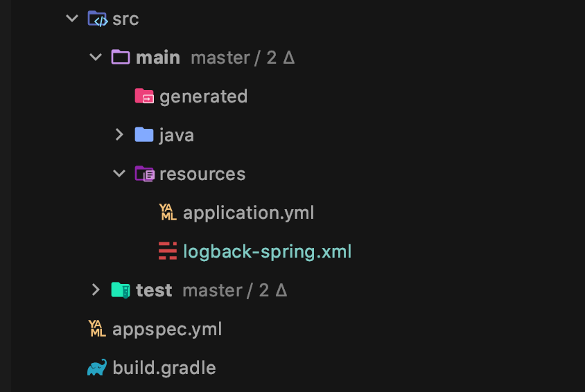

# Logback
#TIL/spring

---

- Logback은 무엇인가?  
	- java.util.logging, log4j, log4j2에 이은 자바 로깅 프레임워크다.
	- 위 유틸들에 비해 좋은 성능을 가지고 있으며, Spring boot에서는 기본 로깅 모듈로 채택하고 있다. (spring-boot-starter-web)

- Appender는 무엇인가?  
	- Logback이 logging event를 발행하도록 위임하는 객체이다.  
	- 실제 `Appender`는 간단한 인터페이스이고, 알려진 구현체는 아래와 같은 구조를 가지고 있다.
	- name 기반의 getter, setter와 이벤트를 수집하는 `void doAppend(E event);` 메소드를 가지고 있다.

[image:1357571C-4D06-4301-BD61-7BBC5B51C29F-395-00001C63A41A9C0B/D5EAB5E9-8D72-4B19-A0DC-574B8B1B5E6B.png]

- AppenderBase
	- Appender 를 구현하고 있는 추상클래스
	- Appender의 doAppend(E event) 메소드를 synchronized 로 구현하고 있다.
		- 이 때문에 멀티스레드 환경에서 같은 Appender를 사용하더라도 안전하다.

- UnsynchronizedAppenderBase
	- 하지만 synchronization이 늘 적절하지는 않기 때문에 logback은 AppnederBase와 유사하지만 synchronized 키워드가 없는 구현체를 제공한다.

- OutputStreamAppender
	- Event를 OutputStream으로 발행하는 객체
	- 사용자가 직접 생성할 일은 없다.
	- ConsoleAppender와 FileAppender의 부모 클래스가 된다.
	- `encoder` property를 갖고 있다.
		- 로그를 어떤 형식으로 남길 것인지를 결정한다.

- ConsoleAppender
	- PrintStream을 사용하여 Console에 로그를 남기는 Appender

- FileAppender
	- 로그를 file로 남기는 Appender
	- append
		- 기본값 true. true면 이미 file이 존재하는 경우 이어서 쓰고, false면 기존 file에 덮어쓴다.
	- file
		- 로그를 남길 file의 이름이다. 해당 파일이 없으면 새로 생성한다.

