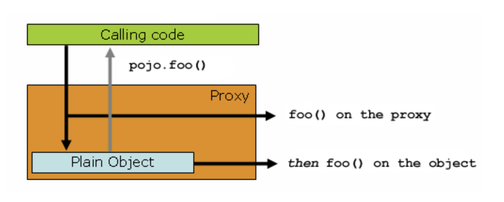

관점 지향 프로그래밍(AOP)는 프로그램 구조에 대한 다른 생각을 제공함으로써 객체 지향 프로그래밍(OOP)을 보완한다.  
OOP에서 모듈화의 핵심 단위는 클래스인 반면, AOP에서 모듈화의 단위는 애스펙트이다.  
애스펙트는 여러 타입과 객체를 관통하는 (트랜잭션 관리 같은) 개념의 모듈화를 가능하게 한다.  

스프링의 핵심 컴포넌트 중 하나가 바로 AOP 프레임워크이다.  
스프링 IoC 컨테이너가 AOP에 의존하지 않는 반면에 (즉, AOP를 사용하고 싶지 않으면 사용하지 않을 수 있다), AOP는 아주 유용한 미들웨어 해결책으로 스프링 IoC를 보완한다.  

AOP는 스프링 프레임워크에서 다음을 위해 사용된다.  

- 선언적 엔터프라이즈 서비스를 제공한다. 이러한 서비스 중 가장 중요한 것은 선언적 트랜잭션 관리이다.
- 사용자가 커스텀한 애스펙트를 구현하여 AOP와 함께 OOP 사용을 보완할 수 있다.

## AOP 개념

몇 가지 중심적인 AOP 개념과 용어를 정의해 보자.  
이 용어들은 스프링에 국한된 용어는 아니다.  
불행히도 AOP 용어가 직관적이지는 않지만, 스프링이 자체 용어를 사용하는 것보다는 덜 혼란스러울 것이다.  

- 애스펙트(Aspect)
    - 여러 클래스를 관통하는 개념의 모듈화이다.  
    트랜잭션 관리가 크로스컷팅 개념의 좋은 예시다.  
    스프링 AOP에서 애스펙트는 일반 클래스에 의해 구현되거나 `@Aspect` 어노테이션에 의해 마킹된 일반 클래스에 의해 구현된다.
- 조인 포인트(Join point)
    - 메서드의 실행이나 예외 처리 같은 프로그램 실행 포인트.  
    스프링 AOP에서 조인 포인트는 항상 메서드 실행을 의미한다.
- 어드바이스(Advice)
    - 특정 조인 포인트에서 애스펙트에 의해 행해지는 행위.  
    어드바이스의 다양한 타입은 "around", "before", "after" 어드바이스를 포함한다.  
    스프링을 포함한 많은 AOP 프레임워크는 어드바이스를 인터셉터로 모델링하고 조인 포인트에 여러 인터셉터의 체인을 유지한다.
- 포인트컷(Pointcut)
    - 조인 포인트에 매칭되는 서술부.  
    어드바이스는 포인트컷 표현식과 연관되며 포인트컷과 매칭되는 모든 조인 포인트에서 실행된다.  
    포인트컷 표현식에 의해 매칭되는 조인 포인트의 개념은 AOP의 핵심이고 스프링은 기본적으로 AspectJ 포인트컷 표현식 언어를 사용한다.
- 인트로덕션(Introduction)
    - 타입을 대신하여 추가 메서드나 필드를 선언한다.  
    스프링 AOP를 사용하면 어드바이스된 객체에 추가적인 인터페이스(및 해당 구현)를 도입할 수 있다.
- 타깃 객체
    - 하나 이상의 애스펙트에게 어드바이스를 받는 객체.  
    "어드바이스된 객체"라고도 한다.  
    스프링 AOP가 런타임 프록시를 사용하여 구현되기 때문에, 이 객체는 항상 프록시 객체이다.
- AOP 프록시
    - 애스펙트 계약을 구현하기 위해 AOP 프레임워크에 의해 생성된 객체.  
    스프링 프레임워크에서 AOP 프록시는 JDK 다이나믹 프록시이거나 CGLIB 프록시이다.
- 위빙(Weaving)
    - 애스펙트를 다른 애플리케이션 타입 또는 객체와 연결해서 새로운 어드바이스된 객체를 만든다.  
    이는 컴파일 타임, 로드 타임, 런타임에 수행할 수 있다.  
    스프링 AOP는 다른 순수 자바 AOP 프레임워크와 마찬가지로 런타임에 위빙을 수행한다.

스프링 AOP는 다음과 같은 어드바이스 타입을 가진다.  

- Before 어드바이스
    - 조인 포인트 전에 수행되는 어드바이스.  
    그러나 (예외를 던지지 않는 한) 조인 포인트로 진행되는 흐름을 막을 능력은 없다.
- After returning 어드바이스
    - 조인 포인트가 일반적으로 완료된 후에 실행되는 어드바이스 (예외를 던지지 않고 메서드가 완료된 경우)
- After throwing 어드바이스
    - 메서드가 예뢰를 발생시킨 경우 실행되는 어드바이스
- After (finally) 어드바이스
    - 조인 포인트가 종료되는 방식(정상이거나 예외를 던지거나)에 상관 없이 실행하는 어드바이스
- Around 어드바이스
    - 조인 포인트를 감싼 어드바이스.  
    이 방식이 가장 강력한 어드바이스이다.  
    Around 어드바이스는 메서드 호출 전후에 커스텀한 행동을 할 수 있다.  
    또한 자체 반환 값을 반환하거나 예외를 던져서 조인 포인트로 진행할지 어드바이스된 메서드 실행을 단축할지 여부를 선택할 책임을 가지고 있다.

Around 어드바이스는 가장 일반적인 경우의 어드바이스이다.  
AspectJ와 같은 스프링 AOP에서 모든 범위의 어드바이스 타입을 제공하는 반면, 우리는 당신이 요구되는 행위를 구현할 수 있는 최소한의 강력한 어드바이스 타입을 사용하기를 권장한다.  
예를 들어, 만약 메서드의 반환 값으로 캐시를 갱신하고 싶다면, 비록 around 어드바이스가 같은 기능을 해낼 수 있을지라도 around 어드바이스 보다는 after returning 어드바이스를 사용하는 것이 좋다.  

## 스프링 AOP의 효용성과 목적

스프링 AOP는 순수 자바로 구현된다.  
특별한 컴파일 과정이 필요하지 않다.  

스프링 AOP는 메서드 실행 시점의 조인 포인트만 지원한다.  
필드 액세스 등의 추가 조인 포인트를 사용해야 하는 경우 AspectJ를 고려하는 것이 좋다.  

AOP에 대한 스프링 AOP의 접근 방식은 다른 AOP 프레임워크의 접근 방식과 다르다.  
스프링 AOP의 목표는 완전한 AOP 구현을 제공하는 것이 아니라, AOP 구현과 스프링 IoC 간의 긴밀한 통합을 제공해서 엔터프라이즈 애플리케이션의 문제를 해결하는 데 도움이 되는 것이다.  

따라서 스프링 프레임워크의 AOP 기능은 일반적으로 스프링 IoC 컨테이너와 함께 사용된다.  
애스펙트는 일반 빈 정의 구문을 사용해서 구성된다.  
이것이 다른 AOP 구현과의 결정적인 차이점이다.  
스프링 AOP로는 매우 세분화된 객체에 애스펙트를 제공할 수 없고, 이런 경우에는 AspectJ가 최선의 선택이다.  
하지만 스프링 AOP는 AOP가 적용되는 엔터프라이즈 자바 애플리케이션의 대부분의 문제에 대한 탁월한 해결책을 제공한다.  

스프링 AOP는 포괄적인 AOP 해결책을 제공하기 위해 AspectJ와 경쟁하지 않는다.  
우리는 스프링 AOP와 같은 프록시 기반 프레임워크와 AspectJ와 같은 완전한 프레임워크가 모두 가치 있고 상호 보완적이라고 믿는다.  
스프링은 AspectJ와 스프링 AOP 및 IoC를 잘 통합하여 일관된 스프링 기반 애플리케이션 아키텍처 내에서 AOP의 모든 사용을 가능하게 한다.  

## AOP 프록시

스프링 AOP는 기본적으로 AOP 프록시에 표준 JDK 다이나믹 프록시를 사용한다.  
이를 통해 모든 인터페이스는 프록싱될 수 있다.  

스프링 AOP는 CGLIB 프록시도 사용할 수 있다.  
이는 인터페이스가 아닌 프록시 클래스에 필요하다.  
기본적으로 비즈니스 객체가 인터페이스를 구현하지 않는 경우에 CGLIB가 사용된다.  

스프링 AOP가 프록시 기반이라는 사실을 파악하는 것이 중요하다.  

## @AspectJ 지원

@AspectJ 는 어노테이션이 붙은 일반 자바 클래스로 애스펙트를 선언하는 스타일을 말한다.  

### @AspectJ 지원 허용

스프링 설정에서 @AspectJ 애스펙트를 사용하기 위해서는 @AspectJ 애스펙트에 기반한 스프링 AOP 설정과 이러한 애스펙트에 의해 어드바이스 되는지 아닌지를 판단하는 자동 프록시 빈의 스프링 지원을 활성화해야 한다.  

@Configuration 으로 @AspectJ 지원을 활성화하려면 다음과 같이 할 수 있다.  

```java
@Configuration
@EnableAspectJAutoProxy
public class AppConfig {

}
```

### Aspect 선언

@AspectJ 지원이 활성화되면 @AspectJ 의 애스펙트와 함께 애플리케이션 컨텍스트에 정의된 모든 빈이 스프링에 의해 자동으로 감지되고 스프링 AOP를 구성하는 데 사용된다.  

```java
package org.xyz;
import org.aspectj.lang.annotation.Aspect;

@Aspect
public class NotVeryUsefulAspect {

}
```

### 포인트컷 선언

포인트컷은 관심사의 조인 포인트를 결정하고, 어드바이스가 언제 실행될지를 조절할 수 있게 한다.  
스프링 AOP는 스프링 빈을 위한 메서드 실행 조인 포인트만을 지원하며, 그러므로 당신은 포인트컷이 스프링 빈에서 메서드 실행과 매칭된다고 생각할 수 있다.  
포인트컷 선언은 두 가지로 나뉘는데, 이름과 모든 파라미터를 포함하는 시그니처와 관심사가 있는 메서드 실행부를 결정하는 포인트컷 표현식이다.  
AOP의 @AspectJ 어노테이션 스타일에 따르면, 포인트컷 시그니처는 표준 메서드 정의에 의해 제공되며, 포인트컷 표현식은 `@Pointcut` 어노테이션을 사용해서 표현된다.  
(포인트컷 시그니처를 표현하는 메서드는 반드시 void 반환을 해야 한다.)  

예시는 다음과 같다.  

```java
@Pointcut("execution(* transfer(..))") // 포인트컷 표현식
private void anyOldTransfer() {} // 포인트컷 시그니처
```

`@Pointcut` 어노테이션에 의한 포인트컷 표현식은 표준 AspectJ 포인트컷 표현식이다.  

스프링 AOP는 다음 AspectJ 포인트컷 지정자를 지원한다.  

- `execution`
    - 메서드 실행 조인 포인트를 매칭한다. 스프링 AOP에서 가장 우선되는 지정자이다.
- `within`
- `this`
- `target`
- `args`
- `@target`
- `@args`
- `@within`
- `@annotation`

스프링 AOP는 또한 `bean` 이라는 추가 지정자를 지원한다.  
이 지정자를 사용하면 특정 이름의 스프링 빈 또는 스프링 빈 세트(와일드카드 사용 시)에 대한 조인 포인트 일치를 제한할 수 있다.  

당신은 `&&`, `||`, `!` 를 사용하여 여러 포인트컷 표현식을 조합할 수 있다.  

```java
@Pointcut("execution(public * *(..))") // public 메서드
private void anyPublicOperation() {} 

@Pointcut("within(com.xyz.myapp.trading..*)") // trading 모듈 내의 메서드
private void inTrading() {} 

@Pointcut("anyPublicOperation() && inTrading()") // trading 모듈 내의 public 메서드
private void tradingOperation() {}
```

엔터프라이즈급 애플리케이션을 설계하다보면, 개발자들은 특정 연산 집합이나 애플리케이션 모듈을 몇 가지 애스펙트로 관리하기를 원한다.  
이러한 목적을 위해 `CommonPointcuts` 애스펙트를 정의해서 일반적인 포인트컷 표현식을 사용하기를 원한다.  

```java
package com.xyz.myapp;

import org.aspectj.lang.annotation.Aspect;
import org.aspectj.lang.annotation.Pointcut;

@Aspect
public class CommonPointcuts {

    @Pointcut("within(com.xyz.myapp.web..*)")
    public void inWebLayer() {}

    @Pointcut("within(com.xyz.myapp.service..*)")
    public void inServiceLayer() {}

    @Pointcut("within(com.xyz.myapp.dao..*)")
    public void inDataAccessLayer() {}

    @Pointcut("execution(* com.xyz.myapp..service.*.*(..))")
    public void businessService() {}

    @Pointcut("execution(* com.xyz.myapp.dao.*.*(..))")
    public void dataAccessOperation() {}

}
```

### 어드바이스 선언

어드바이스는 포인트컷 표현식과 관련이 있고, 포인트컷에 의해 매칭되는 메서드 실행 전, 후, 혹은 전후 시점에 동작한다.  

`@Before` 어노테이션을 통해 before 어드바이스를 선언할 수 있다.  

```java
import org.aspectj.lang.annotation.Aspect;
import org.aspectj.lang.annotation.Before;

@Aspect
public class BeforeExample {

    @Before("com.xyz.myapp.CommonPointcuts.dataAccessOperation()")
    public void doAccessCheck() {
        // ...
    }
}
```

in-place 포인트컷 표현식을 사용한다면 위 예제는 다음과 같이 사용할 수 있을 것이다.  

```java
import org.aspectj.lang.annotation.Aspect;
import org.aspectj.lang.annotation.Before;

@Aspect
public class BeforeExample {

    @Before("execution(* com.xyz.myapp.dao.*.*(..))")
    public void doAccessCheck() {
        // ...
    }
}
```

After returning 어드바이스는 메서드 실행부가 일반적인 반환을 했을 때 수행된다.  
`@AfterReturning` 어노테이션을 사용해서 선언할 수 있다.  

```java
import org.aspectj.lang.annotation.Aspect;
import org.aspectj.lang.annotation.AfterReturning;

@Aspect
public class AfterReturningExample {

    @AfterReturning("com.xyz.myapp.CommonPointcuts.dataAccessOperation()")
    public void doAccessCheck() {
        // ...
    }
}
```

때때로 반환되는 실제 값에 접근해야 할 경우가 있다.  
`@AfterReturning` 에 다음과 같이 바인딩해서 접근할 수 있다.  

```java
import org.aspectj.lang.annotation.Aspect;
import org.aspectj.lang.annotation.AfterReturning;

@Aspect
public class AfterReturningExample {

    @AfterReturning(
        pointcut="com.xyz.myapp.CommonPointcuts.dataAccessOperation()",
        returning="retVal")
    public void doAccessCheck(Object retVal) {
        // ...
    }
}
```

`returning` 속성에 사용된 이름은 반드시 어드바이스 메서드의 파라미터 이름과 동일해야만 한다.  
메서드 실행부가 반환할 때, 반환값은 어드바이스 메서드의 인자로 넘어오게 된다.  
`returning` 절은 또한 메서드 실행부의 반환값 타입만 가능하도록 매칭을 제한해야 한다.  
(위 예제는 Object로, 모든 반환 값을 다 수용한다.)  

After throwing 어드바이스는 매칭되는 메서드 실행부가 예외를 던진 경우 수행된다.  
`@AfterThrowing` 어노테이션으로 선언할 수 있다.  

```java
import org.aspectj.lang.annotation.Aspect;
import org.aspectj.lang.annotation.AfterThrowing;

@Aspect
public class AfterThrowingExample {

    @AfterThrowing("com.xyz.myapp.CommonPointcuts.dataAccessOperation()")
    public void doRecoveryActions() {
        // ...
    }
}
```

종종 당신은 특정 예외 타입이 던져졌을 때 어드바이스가 수행되기를 원하기도 하고, 어드바이스 바디 안에 있는 던져진 예외에 접근하기를 원할 수도 있다.  
`throwing` 속성으로 매칭을 제한하고 어드바이스 파라미터에 던져진 예외를 받을 수 있다.  

```java
import org.aspectj.lang.annotation.Aspect;
import org.aspectj.lang.annotation.AfterThrowing;

@Aspect
public class AfterThrowingExample {

    @AfterThrowing(
        pointcut="com.xyz.myapp.CommonPointcuts.dataAccessOperation()",
        throwing="ex")
    public void doRecoveryActions(DataAccessException ex) {
        // ...
    }
}
```

`throwing` 속성에 사용된 이름은 반드시 어드바이스 메서드의 파라미터 이름과 동일해야만 한다.  
메서드 실행부가 예외를 던질 때, 예외는 어드바이스 메서드의 인자로 넘어오게 된다.  
`throwing` 절은 또한 메서드 실행부가 던지는 예외 타입만 가능하도록 매칭을 제한해야 한다.  

After (Finally) 어드바이스는 메서드 실행부가 끝날 때 수행된다.  
`@After` 어노테이션을 사용해 선언된다.  
After 어드바이스는 일반적인 종료와 예외 상황 모두 다룰 수 있도록 준비되어야 한다.  

```java
import org.aspectj.lang.annotation.Aspect;
import org.aspectj.lang.annotation.After;

@Aspect
public class AfterFinallyExample {

    @After("com.xyz.myapp.CommonPointcuts.dataAccessOperation()")
    public void doReleaseLock() {
        // ...
    }
}
```

어드바이스의 마지막 종류는 Around 어드바이스이다.  
Around 어드바이스는 말 그대로 메서드 실행부 "전후"로 수행된다.  
메서드 실행 전후에 작업을 수행하고 메서드가 실제로 실행되는 시기와 방법, 실행 여부를 결정할 수 있는 기회를 가졌다.  
Around 어드바이스는 메서드 실행부 전후로 스레드 안전한 방식으로 상태를 가져야할 때 많이 사용된다.  
(예를 들면, 스탑워치 같은.)  

Around 어드바이스는 `@Around` 어노테이션을 통해 선언된다.  
어드바이스 메서드의 첫 번째 인자는 `ProceedingJoinPoint` 이다.  
어드바이스 바디에서, ProceedingJoinPoint의 `proceed()` 메서드를 호출하여 조인 포인트 메서드를 실행할 수 있다.  

```java
import org.aspectj.lang.annotation.Aspect;
import org.aspectj.lang.annotation.Around;
import org.aspectj.lang.ProceedingJoinPoint;

@Aspect
public class AroundExample {

    @Around("com.xyz.myapp.CommonPointcuts.businessService()")
    public Object doBasicProfiling(ProceedingJoinPoint pjp) throws Throwable {
        // start stopwatch
        Object retVal = pjp.proceed();
        // stop stopwatch
        return retVal;
    }
}
```

Around 어드바이스의 반환 값은 호출 메서드의 반환 값이다.  
proceed() 메서드는 바디에서 한 번, 혹은 여러 번 호출되거나 전혀 호출되지 않을 수 있다.  

모든 어드바이스 메서드는 첫 번째 파라미터로 `org.aspectj.lang.JoinPoint` 타입을 받을 수 있다.  
JoinPoint 인터페이스는 다음과 같은 유용한 메서드를 제공한다.  

- `getArgs()`
    - 메서드의 인자 반환
- `getThis()`
    - 프록시 객체 반환
- `getTarget()`
    - 타깃 객체 반환
- `getSignature()`
    - 어드바이스된 메서드의 description 반환
- `toString()`
    - 어드바이스된 메서드의 유용한 description 출력

메서드의 인자 값을 어드바이스 바디에서 사용 가능하게 하려면, `args` 를 사용할 수 있다.  
args 표현식에 지정한 타입 이름을 어드바이스의 파라미터로 받을 수 있다.  

```java
@Before("com.xyz.myapp.CommonPointcuts.dataAccessOperation() && args(account,..)")
public void validateAccount(Account account) {
    // ...
}
```

포인트컷 표현식의 `args(account,..)` 부분은 두 가지 역할을 한다.  
첫 번째는 메서드가 하나 이상의 파라미터를 사용하고 해당 파라미터가 Account의 인스턴스인 메서드 실행부로만 매칭을 제한하는 것이다.  
두 번째는 실제 Account 객체를 account 파라미터를 통해 어드바이스에서 사용할 수 있도록 하는 것이다.  

또 다른 방법은 조인 포인트를 매칭할 때 Account 객체 값을 "제공"하는 포인트컷을 선언한 다음 어드바이스에서 해당 포인트컷을 참조하는 방법이 있다.  

```java
@Pointcut("com.xyz.myapp.CommonPointcuts.dataAccessOperation() && args(account,..)")
private void accountDataAccessOperation(Account account) {}

@Before("accountDataAccessOperation(account)")
public void validateAccount(Account account) {
    // ...
}
```

프록시 객체(`this`), 타깃 객체(`target`), 어노테이션들(`@within`, `@target`, `@annotation`, `@args`)도 마찬가지로 비슷하게 사용될 수 있다.  
다음은 어노테이션에 대한 예제이다.  

```java
@Retention(RetentionPolicy.RUNTIME)
@Target(ElementType.METHOD)
public @interface Auditable {
    AuditCode value();
}

@Before("com.xyz.lib.Pointcuts.anyPublicMethod() && @annotation(auditable)")
public void audit(Auditable auditable) {
    AuditCode code = auditable.value();
    // ...
}
```

스프링 AOP는 클래스와 메서드 파라미터에 있는 제네릭도 다룰 수 있다.  

```java
public interface Sample<T> {
    void sampleGenericMethod(T param);
    void sampleGenericCollectionMethod(Collection<T> param);
}

@Before("execution(* ..Sample+.sampleGenericMethod(*)) && args(param)")
public void beforeSampleMethod(MyType param) {
    // Advice implementation
}
```

단, 제네릭 컬렉션은 다음과 같은 형태로 사용할 수 없다.  

```java
@Before("execution(* ..Sample+.sampleGenericCollectionMethod(*)) && args(param)")
public void beforeSampleMethod(Collection<MyType> param) {
    // Advice implementation
}
```

이 작업을 수행하려면 컬렉션의 모든 요소를 검사해야 한다.  
이는 일반적으로 null을 처리하는 방법도 결정할 수 없기 때문에 합리적이지 않다.  
이와 유사한 결과를 얻으려면 `Collection<?>` 에 파라미터를 입력하고 수동으로 검증해야 한다.  

같은 조인 포인트에 여러 개의 어드바이스가 수행되기를 원하면 어떻게 해야 할까?  
스프링 AOP는 AspectJ와 동일한 우선순위 규칙을 따라 어드바이스 실행 순서를 결정한다.  
가장 높은 우선순위의 어드바이스가 "들어오면서" 가장 먼저 실행되고, 반대로 "나갈 때는" 가장 나중에 실행된다.  
(즉, 두 개의 After 어드바이스가 있을 경우 우선순위가 가장 높은 어드바이스가 두 번째로 실행된다.)  

다른 애스펙트로 정의한 두 어드바이스가 하나의 조인 포인트에서 실행되어야 할 때, 특별히 지정하지 않는 한 실행 순서는 정의되지 않는다.  
당신은 우선순위를 정해서 실행 순서를 제어할 수 있다.  
일반적인 스프링에서와 같이 `org.springframework.core.Ordered` 인터페이스를 구현하거나 `@Order` 어노테이션으로 순서를 지정할 수 있다.  
두 애스펙트가 주어진 경우, Ordered.getOrder()에서 더 낮은 값을 반환하는 애스펙트가 더 높은 우선순위를 갖는다.  

우선순위는 @Around, @Before, @After, @AfterReturning, @AfterThrowing 순으로 높다.  
단, @After 어드바이스는 동일한 애스펙트에서 @AfterReturning 또는 @AfterThrowing 어드바이스 이후에 효과적으로 호출되며, @After에 대한 AspectJ의 "after finally 어드바이스" 의미를 따른다.  

### Introductions

인트로덕션을 통해 애스펙트는 어드바이스된 객체가 주어진 인터페이스를 구현한다고 선언하며, 해당 객체를 대신하여 인터페이스의 구현체를 제공할 수 있다.  

이를 `@DeclareParents` 어노테이션을 통해 만들 수 있다.  
이 어노테이션은 매칭 타입이 새로운 부모를 가지도록 선언하는 데 사용된다.  
예를 들어 UsageTracked라는 인터페이스와 구현체인 DefaultUsageTracked가 있을 때, 다음 애스펙트는 서비스 인터페이스의 모든 구현체가 UsageTracked 인터페이스도 구현한다고 선언한다.  

```java
@Aspect
public class UsageTracking {

    @DeclareParents(value="com.xzy.myapp.service.*+", defaultImpl=DefaultUsageTracked.class)
    public static UsageTracked mixin;

    @Before("com.xyz.myapp.CommonPointcuts.businessService() && this(usageTracked)")
    public void recordUsage(UsageTracked usageTracked) {
        usageTracked.incrementUseCount();
    }

}
```

구현될 인터페이스는 어노테이션 필드의 타입에 따라 결정된다.  
`@DeclareParents` 어노테이션의 value 속성은 AspectJ 타입 패턴이다.  
일치하는 타입의 빈은 UsageTracked 인터페이스를 구현하게 된다.  
위 예제의 before 어드바이스에서 서비스 빈은 UsageTracked 인터페이스의 구현체로 직접 사용될 수 있다.  

## 프록시 매커니즘

스프링 AOP는 JDK 다이나믹 프록시 또는 CGLIB를 사용하여 타깃 객체에 대한 프록시를 생성한다.  
JDK 다이나믹 프록시는 JDK에 내장되어 있는 반면 CGLIB는 일반적인 오픈 소스 정의 라이브러리이다. (`spring-core` 에서 재패키징됨)  

프록시 타깃 객체가 하나 이상의 인터페이스를 구현하는 경우 JDK 다이나믹 프록시 방식이 사용된다.  
타깃 타입에 의해 구현된 모든 인터페이스는 프록싱된다.  
만약 타깃이 인터페이스를 구현하지 않았다면 CGLIB 프록시가 생성된다.  

### AOP 프록시 이해하기

스프링 AOP는 프록시 기반이다.  
나만의 애스펙트를 만들거나 스프링이 지원하는 스프링 AOP 기반의 애스펙트를 사용하기 전에 반드시 이 말이 무슨 말인지를 이해하고 있어야만 한다.  

다음과 같이 매우 간단한 객체가 있다고 하자.  

```java
public class SimplePojo implements Pojo {

    public void foo() {
        // 아래 메서드 호출은 'this' 참조를 통해 바로 불려진다.
        this.bar();
    }

    public void bar() {
        // some logic...
    }
}
```

객체 참조값에서 메서드를 호출하면 메서드가 해당 객체 참조값에서 직접 호출된다.  

```java
public class Main {

    public static void main(String[] args) {
        Pojo pojo = new SimplePojo();
        // 이 메서드는 'pojo' 레퍼런스를 호출한다.
        pojo.foo();
    }
}
```

클라이언트 코드에 있는 참조가 프록시인 경우 상황이 약간 달라진다.  

  


```java
public class Main {

    public static void main(String[] args) {
        ProxyFactory factory = new ProxyFactory(new SimplePojo());
        factory.addInterface(Pojo.class);
        factory.addAdvice(new RetryAdvice());

        Pojo pojo = (Pojo) factory.getProxy();
        // 이 메서드는 프록시를 호출한다!
        pojo.foo();
    }
}
```

여기서의 핵심은 Main 클래스의 main() 메서드 내부에 있는 클라이언트 코드에 프록시 참조가 있다는 것이다.  
이는 해당 객체 참조에 대한 메서드 호출이 프록시에 대한 호출임을 의미하고, 결과적으로 프록시는 특정 메서드 호출과 관련된 모든 인터셉터에 기능을 위임할 수 있다.  
그러나 this.bar() 또는 this.foo()와 같이 내부의 자체 메서드를 수행하게 되면, 메서드 호출이 타깃 객체에 의해 일어나기 때문에 프록시가 아니게 된다.  
이것은 중요한 의미를 가지고 있는데, 이는 자체적인 호출로 인해서는 메소드 호출과 관련된 어드바이스가 실행 기회를 얻지 못한다는 것을 의미한다.  

이를 해결하기 위한 가장 좋은 접근은 자기자신의 호출을 하지 않도록 리팩토링하는 것이다.  
이것이 가장 좋은 해결책이고, 침투적이지 않은 방식이다.  
그 다음 선택으로는 절대적으로 끔찍한 방법인데, 다음 예제외 같이 클래스 내의 로직을 스프링 AOP에 완전히 묶어버릴 수 있다.  

```java
public class SimplePojo implements Pojo {

    public void foo() {
        // 끔찍한 일이다.
        ((Pojo) AopContext.currentProxy()).bar();
    }

    public void bar() {
        // some logic...
    }
}
```

이 코드는 당신의 코드와 스프링 AOP의 코드를 완전히 커플링하여 클래스 자체가 스프링 AOP를 사용하고 있다는 사실을 완전히 인식하게 한다.  
심지어 다음과 같은 추가 설정이 필요하다.  

```java
public class Main {

    public static void main(String[] args) {
        ProxyFactory factory = new ProxyFactory(new SimplePojo());
        factory.addInterface(Pojo.class);
        factory.addAdvice(new RetryAdvice());
        factory.setExposeProxy(true);

        Pojo pojo = (Pojo) factory.getProxy();
        // this is a method call on the proxy!
        pojo.foo();
    }
}
```

마지막으로 AspectJ는 프록시 기반 AOP 프레임워크가 아니기 때문에 이러한 호출 문제가 없다는 점을 기억해야 한다.  

## @AspectJ 프록시의 프로그래밍 방식 생성

`org.springframework.aop.aspectj.annotation.AspectJProxyFactory` 클래스를 사용하여 하나 이상의 @AspectJ 애스펙트에서 어드바이스되는 타깃 객체에 대한 프록시를 생성할 수 있다.  
예시는 다음과 같다.  

```java
// 타깃 객체 프록시를 생성할 수 있는 팩토리 생성
AspectJProxyFactory factory = new AspectJProxyFactory(targetObject);

// 애스펙트 추가, 클래스는 @AspectJ 애스펙트일 것
// 여러 애스펙트가 필요한 경우 반복 호출 가능
factory.addAspect(SecurityManager.class);

// 애스펙트 인스턴스도 추가 가능, 제공 객체의 타입은 @AspectJ 애스펙트일 것
factory.addAspect(usageTracker);

// 프록시 객체 얻기
MyInterfaceType proxy = factory.getProxy();
```

## 스프링 애플리케이션에서의 AspectJ

> (문서의 구체적인 내용 대신 간략하게 핵심 개념만 정리합니다.)  
> 
> 스프링 AOP는 런타임 시에 IoC 대상 빈에만 사용할 수 있는 프록시 기반 AOP 기술이다.  
반면 AspectJ는 컴파일, 로드 시점 위빙을 제공하는 AOP 기술이다.  
필요하다면 스프링에서 추가적인 몇 가지 설정을 통해서 AspectJ의 기능들을 사용할 수 있다.  
> 
> 스프링 AOP는 JDK 다이나믹 프록시나 CGLIB 프록시를 사용한 프록시 기반 AOP이고, 메서드 실행 시점만을 조인 포인트로 가진다.  
AspectJ가 사용하기 복잡하기 때문에 IoC 컨테이너를 통한 순수 자바 객체만으로 AOP를 사용하기 위해서 나온 기술이라 볼 수 있다.  
반면 AspectJ는 완전한 AOP를 제공하는 기술이며, 스프링 AOP보다 강력하다.  
런타임 위빙만 지원하는 스프링 AOP에 비해 컴파일 위빙, 로드 시점 위빙을 지원하며(런타임 시에는 아무것도 하지 않는다), 속도도 훨씬 빠르다.  
조인 포인트도 메서드 실행 뿐만 아니라 생성자 호출/실행, 객체 초기화, 필드 참조/변경 등 다양한 시점을 가질 수 있다.
