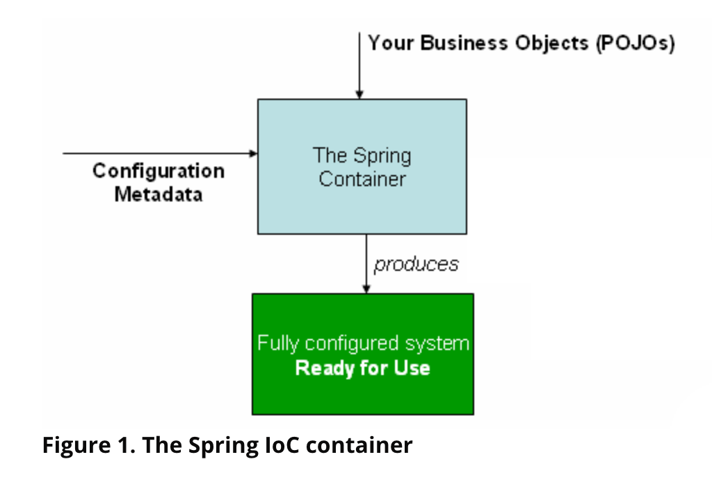

## 1. The IoC Container

첫 챕터에서는 IoC(Inversion of Control)의 원리를 가진 스프링 프레임워크의 구현을 다룬다.  
IoC는 DI(Dependency Injection)라고도 알려져 있다.  

스프링 컨테이너는 빈을 생성할 때 필요한 의존성을 모두 주입한다.  
이 과정은 빈이 자신의 생성이나 의존성에 대해 컨트롤하지 않는 과정이므로 기능적으로 제어의 역전(IoC)인 것이다.  

`org.springframework.beans` 와 `org.springframework.context` 패키지는 스프링 IoC 컨테이너의 기본 패키지이다.  
BeanFactory 인터페이스는 모든 타입의 객체들을 수용하는 설정을 제공한다.  
ApplicationContext는 BeanFactory의 서브 타입으로, 다음을 포함한다.  

- Spring AOP 기능의 손쉬운 통합
- Message Resource 핸들링
- 이벤트 발행
- WebApplicationContext와 같이, 웹 애플리케이션에서 사용되는 특정 응용 계층 컨텍스트

스프링에서는, 우리의 애플리케이션에 기반을 두고, IoC 컨테이너에 의해 관리되는 객체를 빈이라 부른다.  
빈은 스프링 IoC 컨테이너에 의해 생성되고, 응집되고, 관리되는 객체이다.  
반면에, 빈은 애플리케이션의 수많은 객체들 중 하나일 뿐이다.  
여러 빈들과, 그에 따르는 의존성들은 컨테이너를 통해 설정 메타데이터에 반영된다.  

`org.springframework.context.ApplicationContext` 인터페이스는 스프링 IoC 컨테이너를 의미하고, 이는 빈들을 생성하고, 설정하고, 조립하는 역할을 한다.  
컨테이너는 설정 메타데이터를 읽어서 어떤 객체들이 생성되고, 구성되고, 만들어져야 하는지를 알게 된다.  
설정 메타데이터는 XML, 자바 애노테이션, 혹은 자바 코드로 표현된다.  

우리의 애플리케이션은 컨텍스트가 생성되고 초기화된 이후에, 설정 메타데이터와 병합하게 된다.  
그러면 우리는 완전히 구성되고 실행가능한 시스템(애플리케이션)을 얻게 된다.  

