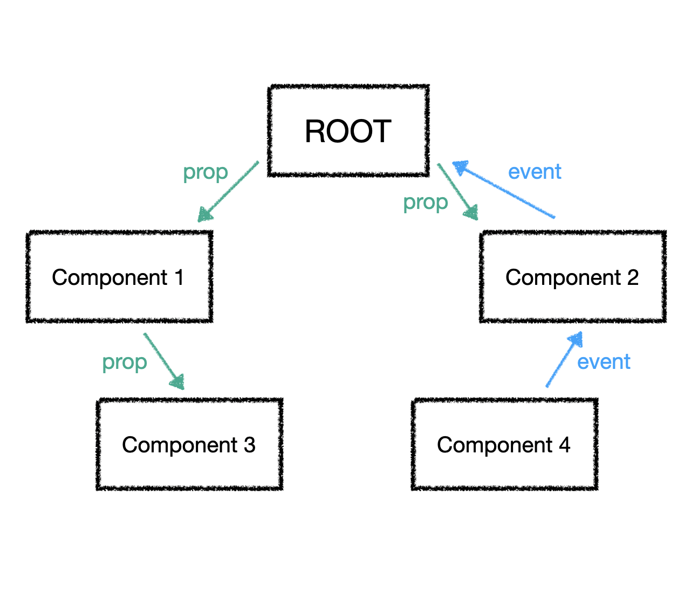
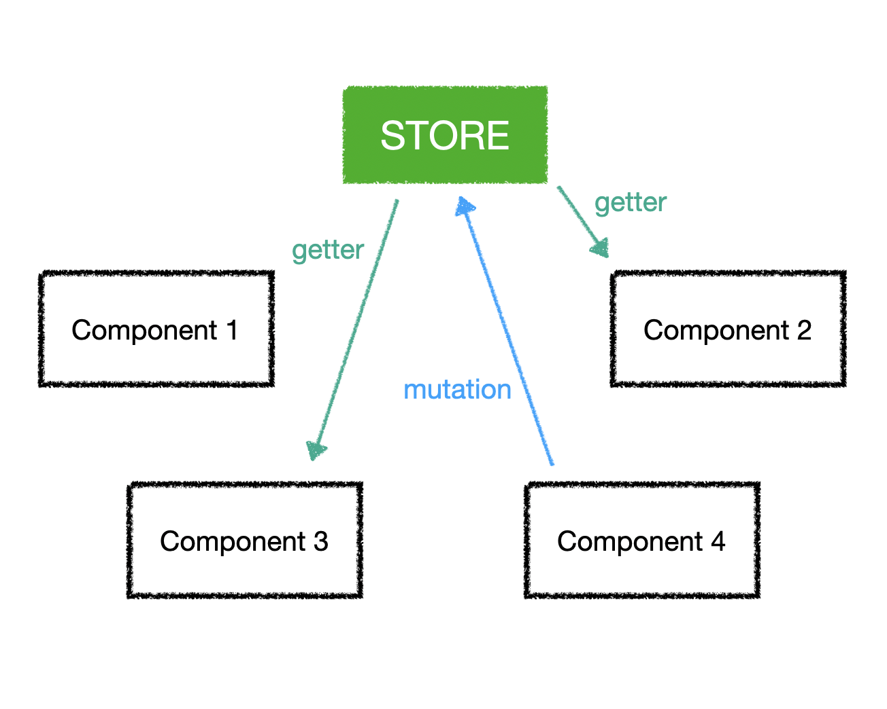

블로그 업로드 : https://www.wbluke.com/32

---

# Vuex Tutirial

## 참고

[Vuex Tutorial - YouTube](https://www.youtube.com/playlist?list=PL4cUxeGkcC9i371QO_Rtkl26MwtiJ30P2)를 보고 정리한 글입니다.

## Vuex 란?

한마디로 Vue.js에서 모든 상태를 한 곳에서 관리해 주는 친구입니다.  

중앙에 Store라는 상태 저장소가 있고, 이 Store는 모든 애플리케이션의 컴포넌트에서 접근이 가능합니다.  


### Vuex를 사용한다면

  

Vue.js만 사용한다면, 보통 여러 컴포넌트 간의 관계는 위와 같은 트리 구조일 것입니다.  

만약 4번 컴포넌트에서 이벤트가 발생해서 다른 컴포넌트들의 상태에 변화를 주어야 한다면, 이벤트는 부모를 타고 올라가 Root 컴포넌트까지 전달된 다음, 다시 props를 통해 다른 하위 컴포넌트들로 전달되어야 하겠죠.  

  

하지만 Vuex를 사용한다면 중앙 저장소인 Store가 있고, 특정 컴포넌트에서 상태를 변경한다면 이 상태를 사용하고 있는 모든 컴포넌트에서는 해당 상태를 중앙 Store에서 가져다가 쓰기만 하면 됩니다.  

이벤트나 상태 전달 시 컴포넌트들 간의 관계를 전부 고려해주어야 하는 리소스가 훨씬 줄어들게 되죠.  

## 중앙 저장소 세팅하기

### Vuex 설치

```
npm install vuex --save
```

npm으로 설치합니다.  

`--save` 옵션은 package.json 파일의 dependencies 항목에 플러그인 정보를 저장하겠다는 의미입니다.  
프로덕션 빌드 시 해당 플러그인을 포함하게 됩니다.  

### Store 생성하기

```js
// store.js

import Vue from 'Vue';
import Vuex from 'vuex';

Vue.use(Vuex);

const store = new Vuex.Store({
  state: {
    fruits: [
      {name: 'apple', price: 3},
      {name: 'banana', price: 4},
      {name: 'strawberry', price: 5}
    ]
  }
});
```

store.js 를 만들고 Store를 생성해 봅시다.  

Vue와 Vuex를 import하고, 전역 Vue에 Vuex를 등록합니다.  
그리고 store라는 이름으로 위와 같이 만든 후, state 필드에 상태를 관리하고 싶은 오브젝트를 세팅합니다.  

store가 상태를 관리하는 오브젝트는 필요한 모든 컴포넌트에서 사용할 수 있습니다.  


### Store 등록하기

만든 store를 사용하려면 먼저 main.js에 등록을 해야 합니다.  

기존에 있던 프로젝트의 main.js에 store.js를 import하고, 아래와 같이 등록합니다.  

```js
import Vue from 'Vue';
import App from './App.vue';
import { store } from './store/store';

new Vue({
  store: store, // store 등록
  el: '#app',
  render: h => h(App)
})
```


## Store 사용하기

### computed 속성으로 등록한 상태 가져오기

상태 관리로 등록한 오브젝트를 컴포넌트에서 사용해 봅시다.  

정적인 계산된 값을 불러오는 computed 속성을 사용한다면, 다음과 같이 사용할 수 있습니다.  

```html
// ExampleComponent.vue

<template>
  <div id="example-component">
    <li v-for="fruit in fruits">
      <span> {{ fruit.name }}</span>
      <span> ${{ fruit.price }}</span>
    </li>
  </div>
</template>

<script>
export default {
  computed: {
    products() {
      return this.$store.state.fruits;
    }
  }
}
</script>
```

`this.$store.state` 를 통해 Store에서 관리되는 상태 오브젝트의 값을 가지고 올 수 있습니다.  


### 등록된 상태의 값을 변경하여 가져오기

만약 등록된 오브젝트의 상태를 변경해서 뿌려주어야 하는데, 이 변경하는 방식 또한 모든 컴포넌트에서 공통으로 사용되는 함수라면 Store에서 관리하는 게 좋을 것입니다.  

예를 들어 예제에서 등록했던 fruits의 가격을 특정 컴포넌트들에서는 반값으로 할인하고 표시해주고 싶다면, 해당 가공 로직은 컴포넌트마다 동일할테니 중앙에서 공통으로 관리하면 좋겠죠?  

이 때는 Store의  `getters` 필드에 사용자 정의 함수를 만들고 사용할 수 있습니다.  

```js
// store.js

const store = new Vuex.Store({
  state: {
    fruits: [
      {name: 'apple', price: 3},
      {name: 'banana', price: 4},
      {name: 'strawberry', price: 5}
    ]
  },
  getters: {
    saleFruits: state => {
      return state.fruits.map(fruit => {
        return {
          name: '**' + fruit.name + '**',
          price: fruit.price / 2
        }
      });
    }
  }
});
```

```js
// ExampleComponent.vue

<script>
export default {
  computed: {
    products() {
      return this.$store.state.fruits;
    },
    saleProducts() {
      return this.$store.getters.saleFruits;
    }
  }
}
</script>
```


### 상태값을 변경하기

어떤 버튼을 누르면 과일들의 가격을 1달러씩 할인하는 기능이 있다고 가정하겠습니다.  
할인이라는 함수의 동작은 특정 컴포넌트에서 일어나지만, 할인된 가격은 다른 컴포넌트에도 동일하게 적용되어야 합니다.  

아까 위에 나온 그림에서, 컴포넌트 쪽에서 Store의 상태값을 변경하는 방식이  `mutation`이라는 키워드였는데요. 사용법은 다음과 같습니다.  

```js
// store.js

const store = new Vuex.Store({
  state: {
    // ...
  },
  getters: {
    // ...
  },
  mutations: {
    reducePrice: state => {
      state.fruits.forEach(fruit => {
        fruit.price -= 1;
      })
    }
  }
});
```

store.js에서 mutations 블록에 state의 값을 변경하는 함수인 reducePrice라는 함수를 작성합니다.  
getter에서 작성했던 함수와 비슷합니다.  

컴포넌트에서는 다음과 같이 사용합니다.  

```js
// ExampleComponent.vue

<script>
export default {
  computed: {
    // ...
  },
  methods: {
    reducePrice: function() { // <template>의 버튼에서 reducePrice 호출
      this.$store.commit('reducePrice');
    }
  }
}
</script>
```

`commit`이라는 키워드로 사용하고자 하는 mutation 함수명을 인자로 넣으면 해당 함수가 실행됩니다.  

이렇게 컴포넌트 별로 method를 작성하는 것보다 Store에서 mutation으로 관리하면 좋은 점이 한 가지 더 있습니다.  

보통 Vue로 개발 시 크롬 브라우저에서 [Vue.js devtools](https://chrome.google.com/webstore/detail/vuejs-devtools/nhdogjmejiglipccpnnnanhbledajbpd)을 많이 사용하실 텐데요.  
각 컴포넌트에서 일반 method로 실행한 함수는 해당 함수가 실행이 되었는지 안되었는지 Vue devtools로 트래킹이 되지 않습니다.  
반대로 mutation은 Store에서 관리하는 함수이기 때문에 Vue devtools에서 실행 여부를 트래킹할 수 있습니다.  


#### strict mode

항상 Store의 상태들을 mutation을 통해서만 변경하도록 강제하고 싶다면 어떻게 해야할까요?  

아래와 같이 strict mode를 적용하면 됩니다.  

```js
// store.js

const store = new Vuex.Store({
  strict: true,
  state: {
    // ...
  },
  // ...
});
```

strict mode가 적용된 Store의 상태값을 mutation이 아닌 함수로 변경하려고 한다면 다음과 같은 에러 메시지가 발생합니다.  

```
Error: [vuex] Do not mutate vuex store state outside mutation handlers.
```


### 비동기로 mutation 함수 실행하기

이번에는 비동기로 mutation 함수를 실행하는 방법을 알아보겠습니다.  

대표적인 async 함수인 setTimeout을 예로 들어서, 2초 뒤에 위에서 작성한 reducePrice `mutation` 함수를 실행시켜야 한다고 가정해 보겠습니다.  

store.js에서 다음과 같이 action을 사용하여 작성할 수 있습니다.  

```js
// store.js

const store = new Vuex.Store({
  state: {
    // ...
  },
  getters: {
    // ...
  },
  mutations: {
    reducePrice: state => {
      state.fruits.forEach(fruit => {
        fruit.price -= 1;
      })
    }
  },
  actions: {
    reducePrice: context => {
      setTimeout(function() {
        context.commit('reducePrice')
      }, 2000)
    }
  }
});
```

인자로 들어오는 context는 Store와 같지는 않지만 거의 Store의 역할을 하고 있다고 생각하면 됩니다.  
Store와 비슷하기 때문에 commit을 활용하여 위에 있는 mutation 함수를 실행시킬 수 있습니다.  

action을 사용하는 컴포넌트는 다음과 같습니다.  

```js
// ExampleComponent.vue

<script>
export default {
  computed: {
    // ...
  },
  methods: {
    reducePrice: function() { // <template>의 버튼에서 reducePrice 호출
      this.$store.dispatch('reducePrice');
    }
  }
}
</script>
```

action을 사용하기 위해 `dispatch`라는 키워드를 사용하고, 인자로 실행할 action 함수명을 넘겨줍니다.  

mutation과 비슷하게, action을 사용하여 얻을 수 있는 장점은 Vue. devtools에서 정확한 디버깅이 가능하다는 것입니다.  

action을 사용하지 않고 단순히 컴포넌트에서 위의 reducePrice 함수를 비동기로 호출한다면, 디버거에는 버튼을 클릭하는 즉시 reducePrice 함수를 실행했다고 나오지만 실제로 화면에 변경된 상태가 반영되는 것은 2초 후여서, 디버거의 시점과 화면의 시점이 정확히 일치하지 않는 어려움이 생깁니다.  
하지만 action을 사용하여 비동기 호출을 한다면, 버튼을 누르고 2초가 지나서 화면이 바뀜과 동시에 디버거에 해당 reducePrice 함수를 실행했다고 나오게 됩니다.  
보다 정확한 디버깅이 가능한 것이죠.  

#### 파라미터와 함께 action 사용하기

action에 파라미터를 같이 넘기고 싶다면 다음과 같이 사용합니다.  

먼저 컴포넌트에서 dispatch의 두 번째 인자로 원하는 파라미터를 넘깁니다.  

```js
// ExampleComponent.vue

<script>
export default {
  computed: {
    // ...
  },
  methods: {
    reducePrice: function(amount) { // 원하는 amount 파라미터 값과 함께 reducePrice 호출
      this.$store.dispatch('reducePrice', amount);
    }
  }
}
</script>
```

그리고 store.js에서는 payload라는 이름으로 넘어온 인자를 받습니다.  

```js
// store.js

const store = new Vuex.Store({
  state: {
    // ...
  },
  getters: {
    // ...
  },
  mutations: {
    reducePrice: (state, payload) => {
      state.fruits.forEach(fruit => {
        fruit.price -= payload; // 원하는 값만큼 가격 차감
      })
    }
  },
  actions: {
    reducePrice: (context, payload) => {
      setTimeout(function() {
        context.commit('reducePrice', payload) // commit도 마찬가지로 두 번째 인자에 파라미터 넘김
      }, 2000)
    }
  }
});
```


### 컴포넌트에 getter와 action 간단하게 등록하기

Store에 있는 getter와 action을 각각의 컴포넌트에서 매번 `this.$store`를 통해 호출하는 것도 여간 귀찮은 일이 아닐 것입니다.  

이럴 때 mapGetters와 mapActions를 사용하면 getter와 action의 목록에서 필요한 함수만 가져와서 등록을 할 수 있습니다.  

```js
// ExampleComponent.vue

<script>
import {mapActions} from 'vuex';
import {mapGetters} from 'vuex';

export default {
  computed: {
    ...mapGetters([ // 등록하고 싶은 함수들을 배열로 등록
      'saleFruits'
    ])
  },
  methods: {
    ...mapActions([ // 등록하고 싶은 함수들을 배열로 등록
      'reducePrice'
    ])
  }
}
</script>
```

[ES6의 스프레드 연산자](https://developer.mozilla.org/ko/docs/Web/JavaScript/Reference/Operators/Spread_syntax)를 사용하여 mapGetters와 mapActions에서 원하는 함수들을 함수명만 가지고 등록할 수 있습니다.  

#### ES6 연산자가 적용되지 않는 경우

콘솔에서 ES6 문법을 받아들이지 못한다면 해당 문법의 해석을 도와주는 babel을 설치합니다.  

```js
npm install babel-preset-stage-2 --save-dev
```

npm으로 설치 후 `.babelrc`에서 방금 설치한 stage-2를 추가합니다.  

```js
// .babelrc

{
  "presets": [
    ["env", {"modules": false}],
    ["stage-2"] // stage-2 추가
  ]
}
```

설치한 플러그인을 적용하기 위해 서버를 다시 재시작하면 ES6 문법이 문제없이 잘 적용되는 것을 보실 수 있습니다.  
